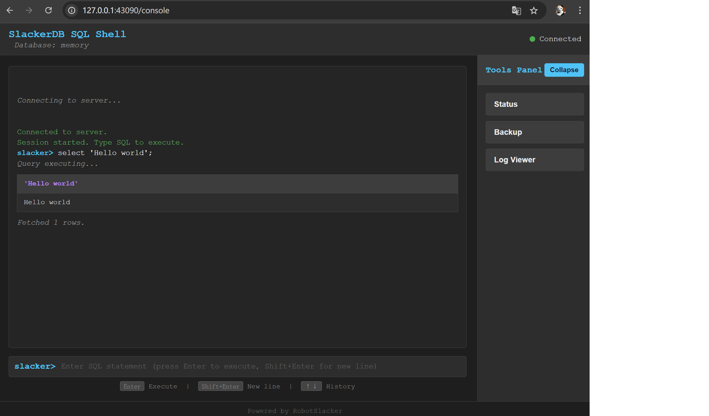

.RobotSlacker
image::robotslacker.jpg[RobotSlacker]

== SlackerDB (DuckDB Postgres proxy)

=== Quick Note

This is an agile DuckDB extension that provides Java-based connectivity
with network access and multiprocess support.

==== What we can do:

Based on the description, this extension can do following:

* Enables remote access to DuckDB via TCP/IP from network, instead of
local connect only restriction.
* Supports multiprocess access to DuckDB instead of single-process
restriction.
* Provides PostgreSQL wire protocol compatibility (JDBC, ODBC, etc.),
allowing DuckDB to serve as a PostgreSQL database.
* Offers a dedicated access client, which has:
[arabic]
. Advanced features
. Comprehensive data dictionary access support
* You can use COPY syntax to import data with high performence, this
compatible with PG CopyManager.
* Provides self-managed data services and API.
* You have multiple ways to connect to this extension:
** Directly connect to the server with jdbc, odbc, ...
** Connect through a connection gateway which multiple servers(can on
different host or different process) are behinds it.
** Embed the compiled jar package into your own application.
** Register a data service and access data through REST API.

=== Usage

==== Build from source:

....
    # make sure you have JDK17 and maven 3.6+ ready.
    # Download source code
    git clone ...
    # compile it
    cd slackerdb
    mvn clean compile package -Dmaven.test.skip=true

    # All compiled results will be placed in the dist directory.
    #    compiled Jar packages,
    #    source jar packages
    #    default configuration files.
....

==== Start db server

....
    java -jar dbserver/target/slackerdb-dbserver-0.1.9-standalone.jar start
....

==== Stop db server

....
    java -jar dbserver/target/slackerdb-dbserver-0.1.9-standalone.jar stop
....

==== Check db status

....
    java -jar dbserver/target/slackerdb-dbserver-0.1.9-standalone.jar status
....

==== Start db proxy

....
    java -jar dbproxy/target/slackerdb-dbproxy-0.1.9-standalone.jar start
....

==== Stop db proxy

....
    java -jar dbproxy/target/slackerdb-dbproxy-0.1.9-standalone.jar stop
....

==== Check proxy status

....
    java -jar dbproxy/target/slackerdb-dbproxy-0.1.9-standalone.jar status
....

==== Server configuration file template

....
# Database name, default is none.
data=

# Path where data files are saved
# ":memory:" indicates in-memory mode (data will be lost after restart)
data_dir=:memory:

# Temporary files directory during operations
# Disk mode:   Defaults to data_dir if not specified
# Memory mode: Defaults to system temp directory if not specified
# Recommended: Use high-performance storage for temp_dir
temp_dir=

# Directory for extension plugins
# Default: $HOME/.duckdb/extensions
extension_dir=

# Run as background daemon (true/false)
daemon=

# PID file location
# - Locks exclusively during server operation
# - Startup aborts if file is locked by another process
# - No file created if not configured, and no lock.
pid=

# Log output destinations (comma-separated)
# "CONSOLE" for stdout, file paths for file logging
log=CONSOLE,logs/slackerdb.log

# Log verbosity level
log_level=INFO

# Main service port
# 0 = random port assignment
# -1 = disable network interface
# Default: 0 (disabled)
port=

# Data service API port
# 0 = random port assignment
# -1 = disable interface (default)
port_x=

# Network binding address
bind=0.0.0.0

# Client connection idle timeout (seconds)
client_timeout=600

# External remote listener registry endpoint
# Format: IP:PORT
# Default: none (disabled)
remote_listener=

# Database opening mode.
# Default: READ_WRITE
access_mode=READ_WRITE

# Maximum concurrent connections
# Default: 256
max_connections=

# Maximum worker threads
# Default: CPU core count
max_workers=

# Database engine threads
# Default: 50% of CPU cores
# Recommendation: 5-10GB RAM per thread
threads=

# Memory usage limit (K/M/G suffix)
# Default: 60% of available memory
# -1 = unlimited (memory mode only)
memory_limit=

# Database template file
template=

# Initialization script(s)
# Executes only on first launch
# Accepts: .sql file or directory
init_script=

# Startup script(s)
# Executes on every launch
# Accepts: .sql file or directory
startup_script=

# System locale
# Default: OS setting
locale=

# SQL command history
# ON = enable tracking
# OFF = disable (default)
sql_history=OFF

# Minimum idle connections in pool
connection_pool_minimum_idle=3

# Maximum idle connections in pool
connection_pool_maximum_idle=10

# Connection lifetime (milliseconds)
connection_pool_maximum_lifecycle_time=900000

# Query result cache configuration (in bytes)
# - Only caches API request results (JDBC queries unaffected)
# - Default: 1GB (1073741824 bytes)
# - Set to 0 to disable caching
query_result_cache_size=

# Data service schema initialization
# - Accepts:
#   * JSON file path (single schema)
#   * Directory path (loads all *.service files)
# - Schema files should contain service definitions in JSON format
data_service_schema=

# MCP configuration file/path
# Specifies the Model Context Protocol configuration file for dynamic tool/resource loading.
# - Accepts:
#   * JSON file path (single config)
#   * Directory path (loads all *.mcp files)
# Default: empty (no MCP configuration)
mcp_config=
....

==== Proxy configuration file template

....
# PID file location
# - Locks exclusively during server operation
# - Startup aborts if file is locked by another process
# - No file created if not configured, and no lock.
pid=

# Log output destinations (comma-separated)
# "CONSOLE" for stdout, file paths for file logging
log=CONSOLE,logs/slackerdb-proxy.log

# Log level
log_level=INFO

# Run as background daemon (true/false)
daemon=

# Main service port
# 0 = random port assignment
# -1 = disable network interface
# Default: 0 (disabled)
port=0

# Data service API port
# 0 = random port assignment
# -1 = disable interface (default)
port_x=0

# Network binding address
bind=0.0.0.0

# Client connection idle timeout (seconds)
client_timeout=600

# Maximum worker threads
# Default: CPU core count
max_workers=

# System locale
# Default: OS setting
locale=
....

Note: All parameters are optional. +
You can keep only the parameters you need to modify. +
For parameters that are not configured, default values will be used.

==== JDBC Support

SlackerDB provides full PostgreSQL wire protocol compatibility, allowing you to connect using standard JDBC drivers. This enables you to use any PostgreSQL‑compatible JDBC client, including the native SlackerDB JDBC driver for optimal integration.

*PostgreSQL JDBC Driver*
You can use the standard PostgreSQL JDBC driver (`org.postgresql.Driver`) with the connection URL format `jdbc:postgresql://host:port/database`. This is useful when you want to reuse existing PostgreSQL tooling.

*SlackerDB JDBC Driver*
For better integration and additional features, use the native SlackerDB JDBC driver (`org.slackerdb.jdbc.Driver`). The connection URL format is `jdbc:slackerdb://host:port/database`. This driver is included in the distribution and is recommended for new applications.

*Connection Examples*

....
// PostgreSQL JDBC driver
String url = "jdbc:postgresql://127.0.0.1:3175/db1";
Connection conn = DriverManager.getConnection(url, "main", "");
conn.setAutoCommit(false);

// SlackerDB JDBC driver
String url = "jdbc:slackerdb://127.0.0.1:3175/db1";
Connection conn = DriverManager.getConnection(url, "main", "");
conn.setAutoCommit(false);
....

*IDE Integration*

You can connect to SlackerDB from database tools DBeaver. (For other tools, we have not verified it.) +
*Use Postgresl driver* +
Download postgresql server and connect database like a pg.

*Use custom driver* +
Since native Postgres clients often use some data dictionary information
that duckdb doesn’t have, +
You can create a generic JDBC driver with the following settings: +

....
Dbeaver:
Database -> Driver Manager -> New
   Database type: generic database.
   Class name:    org.slackerdb.jdbc.Driver
   URL template:  jdbc:slackerdb://{host}:{port}/[{database}]
....

*ODBC and Python*
SlackerDB also supports ODBC and Python connections via the same PostgreSQL wire protocol. Refer to the respective client documentation for setup details.

==== Data Service

* Data service work with port_x, please make sure you have enabled it in
server configuration or from command parameter. It’s important to note
that we have no consider on data security. This means data services must
work in a trusted environment.

===== user login

User login (note: this is optional). After success, a token will be
provided. +
Context operations or SQL access that requires context variables will
require token. +
If your program does not involve context feature, you can ignore this
login. +
Put it simplify, the token is currently used as the user ID.

[cols=",",options="header",]
|===
|Attribute |Value
|Protocol |HTTP
|Method |POST
|Path |`+/api/login+`
|===

Response example:

....
Success response (200)

  {
    "retCode": 0,
    "token": “yJhbGciOiJIUzI1NiIsInR5cCI6IkpXVCJ9”,
    "retMsg": "Login successful."
  }
....

===== user logout

User logout

[cols=",",options="header",]
|===
|Attribute |Value
|Protocol |HTTP
|Method |POST
|Path |`+/api/logout+`
|===

headers:

[cols=",",options="header",]
|===
|Attribute |Value
|Authorization |NzJjYjE3NmQtN2Y2ZC00OWMyLWIwODAtYTU1MDE3YzVmZDU1
|===

The token information here is obtained when call /login in earlier

Response example:

....
Success response (200)

  {
    "retCode": 0,
    "retMsg": "Successful."
  }
....

===== set context

set context

[cols=",",options="header",]
|===
|Attribute |Value
|Protocol |HTTP
|Method |POST
|Path |`+/api/setContxt+`
|===

headers:

[cols=",",options="header",]
|===
|Attribute |Value
|Authorization |NzJjYjE3NmQtN2Y2ZC00OWMyLWIwODAtYTU1MDE3YzVmZDU1
|===

The token information here is obtained when call /login in earlier

request body:

[cols=",",options="header",]
|===
|Attribute |Value
|key1 |value1
|key2 |value2
|… |…
|keyx |valuex
|===

You can set one or more key-value pairs at once, or you can set multiple
key-value pairs by calling setContext multiple times.

Response example:

....
Success response (200)

  {
    "retCode": 0,
    "retMsg": "Successful."
  }
....

===== removeContext

remove context

[cols=",",options="header",]
|===
|Attribute |Value
|Protocol |HTTP
|Method |POST
|Path |`+/api/removeContxt+`
|===

headers:

[cols=",",options="header",]
|===
|Attribute |Value
|Authorization |NzJjYjE3NmQtN2Y2ZC00OWMyLWIwODAtYTU1MDE3YzVmZDU1
|===

The token information here is obtained when call /login in earlier

request body:

[cols=",",options="header",]
|===
|Attribute |Value
|removedKeyList |[key1,key2, ….]
|===

You can remove one or more key-value pairs at once, or you can remove
multiple key-value pairs by calling removeContext multiple times.

Response example:

....
Success response (200)

  {
    "retCode": 0,
    "retMsg": "Successful."
  }
....

===== registerService

register a service

[cols=",",options="header",]
|===
|Attribute |Value
|Protocol |HTTP
|Method |POST
|Path |`+/api/registerService+`
|===

request body:

[width="100%",cols="20%,80%",options="header",]
|===
|Attribute |Value
|serviceName |service name

|serviceVersion |service version

|serviceType |service type, GET/POST

|searchPath |sql default search path, Optional parameter

|sql |SQL statement, can contain such $\{var1} variable information

|description |description

|snapshotLimit |how long the query result will be cached, Optional
parameter

|parameter |parameter default value when query api not provide parameter
value
|===

snapshotLimit format: 3 hours / 30 minutes / 45 seconds

Request example:

....
  {
    "serviceName": "queryTest1",
    "serviceVersion": "1.0",
    "serviceType": "GET",
    "sql", "SELECT 1"
  }
....

Response example:

....
Success response (200)

  {
    "retCode": 0,
    "retMsg": "Successful."
  }
....

===== unRegisterService

unregister a service

[cols=",",options="header",]
|===
|Attribute |Value
|Protocol |HTTP
|Method |POST
|Path |`+/api/unRegisterService+`
|===

request body:

[width="100%",cols="20%,80%",options="header",]
|===
|Attribute |Value
|serviceName |service name
|serviceVersion |service version
|serviceType |service type, GET/POST
|===

Request example:

....
  {
    "serviceName": "queryTest1",
    "serviceVersion": "1.0",
    "serviceType": "GET",
  }
....

Response example:

....
Success response (200)

  {
    "retCode": 0,
    "retMsg": "Successful."
  }
....

===== listRegisteredService

list all service

[cols=",",options="header",]
|===
|Attribute |Value
|Protocol |HTTP
|Method |GET
|Path |`+/api/listRegisteredService+`
|===

Response example:

....
Success response (200)

  {
    "retCode": 0,
    "retMsg": "Successful."
    "services":
      {
        "Query1":
        {
          "seviceName" : "Query1",
          "serviceType" : "GET",
          ....
        }
      }
  }
....

===== /api/\{apiVersion}/\{apiName}

API query

[cols=",",options="header",]
|===
|Attribute |Value
|Protocol |HTTP
|Method |POST or GET
|Path |`+/api/{apiVersion}/{apiName}+`
|===

headers:

[width="100%",cols="18%,82%",options="header",]
|===
|Attribute |Value
|Authorization |NzJjYjE3NmQtN2Y2ZC00OWMyLWIwODAtYTU1MDE3YzVmZDU1

|snapshotLimit |Optional. used to overwrite service definition. 0 means
no result cache
|===

The token information here is obtained when call /login. +
The token is optional, if you use context in your sql statement, you
must set it. +
snapshotLimit format: 3 hours / 30 minutes / 45 seconds

GET Request example:

....
  GET /api/1.0/queryApi?context1=xxx&context2=yyy
....

POST Request example:

....
  POST /api/1.0/queryApi

  {
    "context1": "xxx",
    "context2": "yyy",
  }
....

Response example:

....
Success response (200)

  {
    "retCode": 0,
    "retMsg": "Successful."
    "description" "test 1",
    "cached": false,
    "timestamp": 17777700,
    "data":
      {
        "columnNames":["col1","col2","col3"],
        "columnTypes":["INTEGER","INTEGER","VARCHAR"],
        "dataset":[[1,2,"中国"]]
      }
  }
....

==== SQL REPL Server

SQL REPL Server provides an asynchronous WebSocket interface for executing SQL queries and fetching results in pages.
It is useful for long-running queries where you want to avoid blocking the client, and aligns with the MCP (Model Context Protocol) philosophy of using WebSocket for bidirectional communication.

To use it, ensure the data service API port (port_x) is enabled in server configuration.

===== WebSocket Endpoint

Connect to the WebSocket endpoint:

[cols=",",options="header",]
|===
|Attribute |Value
|Protocol |WebSocket (ws:// or wss://)
|Path |`+/sql/ws+`
|===

Once connected, you can send JSON messages with the following general format:

....
{
  "id": "unique-request-id",   // used to match responses
  "type": "message-type",      // one of: start, exec, fetch, cancel, close
  "data": { ... }              // payload specific to the message type
}
....

The server will respond with a JSON message that mirrors the request `id` and includes a `retCode` (0 for success, non‑zero for error) and relevant data.

===== Session Management

A session is created by sending a `start` message. The server returns a `sessionId` that must be included in subsequent messages for the same session.

Start message:

....
{
  "id": "1",
  "type": "start",
  "data": {}
}
....

Response:

....
{
  "id": "1",
  "retCode": 0,
  "retMsg": "Session created",
  "sessionId": "session-123"
}
....

All further messages for this session must include `"sessionId": "session-123"` in their `data` field.

===== Execute SQL (async)

Submits a SQL statement for asynchronous execution. Returns a task ID that can be used to fetch results later.

Message:

....
{
  "id": "2",
  "type": "exec",
  "data": {
    "sessionId": "session-123",
    "sql": "SELECT * FROM large_table",
    "fetchSize": 1000   // optional, default is 1000
  }
}
....

Response:

....
{
  "id": "2",
  "retCode": 0,
  "retMsg": "Task submitted",
  "taskId": "550e8400-e29b-41d4-a716-446655440000",
  "status": "running"   // or "completed" if result fits in first page
}
....

If the SQL execution fails immediately (e.g., syntax error), the response will contain `retCode` != 0 and an error message.

===== Fetch Results

Retrieves a page of results for a given task ID. The endpoint returns a fixed number of rows (up to `fetchSize` specified in execute) and indicates whether more rows are available.

Message:

....
{
  "id": "3",
  "type": "fetch",
  "data": {
    "sessionId": "session-123",
    "taskId": "550e8400-e29b-41d4-a716-446655440000",
    "maxRows": 100   // optional, overrides the default page size
  }
}
....

Response:

....
{
  "id": "3",
  "retCode": 0,
  "retMsg": "Success",
  "taskId": "550e8400-e29b-41d4-a716-446655440000",
  "status": "completed",   // "running", "completed", or "error"
  "hasMore": false,        // true if there are more rows to fetch
  "columns": ["id", "name"],
  "rows": [
    {"id": 1, "name": "Alice"},
    {"id": 2, "name": "Bob"}
  ],
  "fetched": 2
}
....

If the task is still running (status = "running"), `rows` may be empty and `hasMore` will be true.
If the task has completed and all rows have been fetched, `status` becomes "completed" and `hasMore` false.
If an error occurs during execution, `status` becomes "error" and `retMsg` contains the error details.

You can send multiple `fetch` messages until `hasMore` becomes false. Each call returns the next page of rows.

===== Cancel Task

Cancels an ongoing SQL task. If no taskId is provided, cancels the current session's active task.

Message:

....
{
  "id": "4",
  "type": "cancel",
  "data": {
    "sessionId": "session-123",
    "taskId": "550e8400-e29b-41d4-a716-446655440000"   // optional, omit to cancel the session's active task
  }
}
....

Response:

....
{
  "id": "4",
  "retCode": 0,
  "retMsg": "Task cancelled"
}
....

===== Close Session

Closes the session and releases all associated resources (including any pending tasks).

Message:

....
{
  "id": "5",
  "type": "close",
  "data": {
    "sessionId": "session-123"
  }
}
....

Response:

....
{
  "id": "5",
  "retCode": 0,
  "retMsg": "Session closed"
}
....

After closing, the session ID is no longer valid.

===== Example Workflow (using JavaScript/Node.js)

1. Connect to WebSocket endpoint:
+
[source,javascript]
----
const WebSocket = require('ws');
const ws = new WebSocket('ws://localhost:8080/sql/ws');
----

2. Create a session:
+
[source,javascript]
----
ws.send(JSON.stringify({
  id: "1",
  type: "start",
  data: {}
}));
----

3. Execute a long query:
+
[source,javascript]
----
ws.send(JSON.stringify({
  id: "2",
  type: "exec",
  data: {
    sessionId: "session-123",
    sql: "SELECT * FROM huge_table",
    fetchSize: 500
  }
}));
----

4. Fetch first page:
+
[source,javascript]
----
ws.send(JSON.stringify({
  id: "3",
  type: "fetch",
  data: {
    sessionId: "session-123",
    taskId: "abc123",
    maxRows: 100
  }
}));
----

5. Fetch subsequent pages until `hasMore` becomes false.

6. Optionally cancel if needed:
+
[source,javascript]
----
ws.send(JSON.stringify({
  id: "4",
  type: "cancel",
  data: {
    sessionId: "session-123",
    taskId: "abc123"
  }
}));
----

7. Close the session when done:
+
[source,javascript]
----
ws.send(JSON.stringify({
  id: "5",
  type: "close",
  data: {
    sessionId: "session-123"
  }
}));
----

*Note:* The examples above assume you handle incoming messages asynchronously. In a real client you would match responses by their `id`.

==== Basic Services
The following HTTP endpoints provide basic administrative functions, such as backup, file upload/download, log viewing, and status monitoring. These endpoints are available when the Data Services API port (port_x) is enabled.

===== /backup (POST)

Performs a database backup. The backup file is saved in the `backup/` directory with the naming pattern `\{database\}_\{backupTag\}.db`.

.Request body (JSON):
[source,json]
----
{
  "backupTag": "mybackup"
}
----

.Response example (success):
[source,json]
----
{
  "retCode": 0,
  "retMsg": "Successful. Backup file has placed to [C:\\Work\\slackerdb\\backup\\mydb_mybackup.db]."
}
----

===== /download (GET)

Downloads a file from the server's working directory.

.Query parameters:
* `filename` (required) – relative path to the file.

.Example:
 GET /download?filename=logs/slackerdb.log

The endpoint supports Range requests for partial downloads.

===== /upload (POST)

Uploads a file to the server's working directory.

.Query parameters:
* `filename` (required) – target file path.

.Form data:
* `file` (required) – the file to upload.

.Example using curl:
[source,bash]
----
curl -X POST -F "file=@local.txt" "http://localhost:8080/upload?filename=uploads/remote.txt"
----

.Response:
[source,json]
----
"uploaded: C:\\Work\\slackerdb\\uploads\\remote.txt"
----

===== /viewLog (GET)

Retrieves the last N lines of a log file.

.Query parameters:
* `filename` (required) – path to the log file.
* `lines` (optional) – number of lines to return (default 100, max 10000).

.Example:
 GET /viewLog?filename=logs/slackerdb.log&lines=50

.Response (JSON array of strings):
[source,json]
----
[
  "2025-12-04 10:00:00 INFO  Server started",
  "2025-12-04 10:00:01 INFO  Listening on port 8080"
]
----

===== /status (GET)

Returns comprehensive server status information, including server details, database metrics, configuration parameters, usage statistics, installed extensions, and active sessions.

.Example:
 GET /status

.Response (abbreviated):
[source,json]
----
{
  "server": {
    "status": "RUNNING",
    "version": "0.1.9",
    "build": "2025-12-04 10:00:00.000 UTC",
    "pid": 12345,
    "now": "2025-12-04 15:20:00",
    "bootTime": "2025-12-04 10:00:00",
    "runTime": "5 hours, 20 minutes, 0 seconds"
  },
  "database": {
    "version": "v1.0.0",
    "size": "1.2 GB",
    "memoryUsage": "256 MB",
    "walSize": "0 B"
  },
  "parameters": {},
  "usage": {},
  "extensions": [],
  "sessions": []
}
----
==== Web-based SQL Console

*Note: The web console is **not a production‑ready feature**. It is a demonstration tool designed to help you understand and verify the backend services (Data Service, MCP Tool, and MCP Resource) in a visual, interactive way.*

SlackerDB includes a web‑based SQL console that provides an interactive interface for executing SQL queries, viewing results, and performing administrative tasks directly from your browser. In addition to the core SQL REPL, the console offers dedicated panels for managing **Data Service**, **MCP Tool**, and **MCP Resource** – three key extension mechanisms of the SlackerDB ecosystem.

*Access:* After starting the server with the data‑service API port (`port_x`) enabled, open `http://<server>:<port_x>/console.html` in a modern browser.

*Features:*

* **Interactive SQL Shell:** Type SQL statements at the prompt and execute them with Enter. Command history is available with up/down arrows.
* **WebSocket Connection:** The console automatically connects to the SQL REPL server via WebSocket (`/sql/ws`) and manages sessions.
* **Tabular Results:** Query results are displayed as formatted tables with column names and types.
* **Sidebar Tools Panel:** Provides quick access to:
** *Server Status* – detailed modal with server metrics, database parameters, usage statistics, extensions, and active sessions.
** *Backup Database* – modal to create a backup with optional download of the resulting file.
** *Log Viewer* – modal to inspect server logs in real time.
* **Connection Indicator:** Visual indicator shows whether the console is connected to the server.
* **Asynchronous Execution:** Long‑running queries are executed asynchronously; results can be fetched in pages.
* **Data Service Management Panel:** Register, list, load, save, and unregister data services. You can also download the service definitions as a JSON file (the download will prompt you to choose a save location via the browser’s file‑picker dialog).
* **MCP Tool Management Panel:** List, load, save, and unregister MCP (Model Context Protocol) tools. Download the tool definitions as JSON (with file‑picker dialog).
* **MCP Resource Management Panel:** List, load, save, and unregister MCP resources. Download the resource definitions as JSON (with file‑picker dialog).

*Usage:*

1. Ensure the server is running with `port_x` configured (e.g., `port_x=8080`).
2. Navigate to `http://localhost:8080/console.html`.
3. The console will attempt to connect automatically. Once connected, you can start typing SQL.
4. Use the left‑sidebar buttons to switch between the **Console**, **Data Service**, **MCP Tool**, and **MCP Resource** views.
5. In each management panel you can:
   * Refresh the list of registered items.
   * Select items with checkboxes and perform batch operations (unregister, download).
   * Load definitions from a JSON file.
   * Save definitions to the server’s configuration directory.
   * Download definitions as a JSON file – the browser will show a file‑save dialog, allowing you to choose the location and filename.
6. Use the right‑sidebar buttons to open status, backup, or log modals.

The console is built with plain HTML/JavaScript and requires no additional installation. It is intended for development, testing, and administrative purposes in trusted environments. Its primary goal is to demonstrate how the backend services work and to provide a convenient way to experiment with the Data Service, MCP Tool, and MCP Resource subsystems.

==== Embed the db server in your code

....
  // create configuration,  and update as your need
  ServerConfiguration serverConfiguration = new ServerConfiguration();
  serverConfiguration1.setPort(4309);
  serverConfiguration1.setData("data1");

  // init database
  DBInstance dbInstance= new DBInstance(serverConfiguration1);

  // startup database
  dbInstance1.start();

  // shutdown database
  dbInstance.stop();

  // We currently supports starting multiple instances running at the same time.
  // But each instance must have his own port and instance name.
....

==== Embed the db proxy in your code

....
    ServerConfiguration proxyConfiguration = new ServerConfiguration();
    proxyConfiguration.setPort(dbPort);
    ProxyInstance proxyInstance = new ProxyInstance(proxyConfiguration);
    proxyInstance.start();

    // Waiting for server ready
    while (!proxyInstance.instanceState.equalsIgnoreCase("RUNNING")) {
        Sleeper.sleep(1000);
    }
....

==== Data Security
Based on DuckDB's secure encryption mechanism, we support data encryption.

To use this feature, you need to:

1. Set the parameter data_encrypt to true.
2. Set the database key through any of the following three methods:
     . Environment variable: SLACKERDB_<dbName>_KEY (where <dbName> is replaced with the name of your database instance).
     . Java property: Specify it when starting the program as -DSLACKERDB_<dbName>_KEY=....
     . After startup, specify it via the statement:  ALTER DATABASE <dbName> SET Encrypt Key <key>.

=== Known Issues

==== 1. User and password authorization

We do not support user password authentication, just for compatibility,
keep these two options. +
you can fill anything as you like, it doesn’t make sense.

==== 2. Limited support for duckdb datatype

Only some duckdb data types are supported, mainly simple types, such as
int, number, double, varchar, … For complex types, some are still under
development, and some are not supported by the PG protocol, such as
blob, list, map… You can refer to sanity01.java to see what we currently
support.

==== 3. postgresql-fdw

fdw will use "`Declare CURSOR`" to fetch remote data, while duck doesn’t
support this.

=== Roadmap

…
