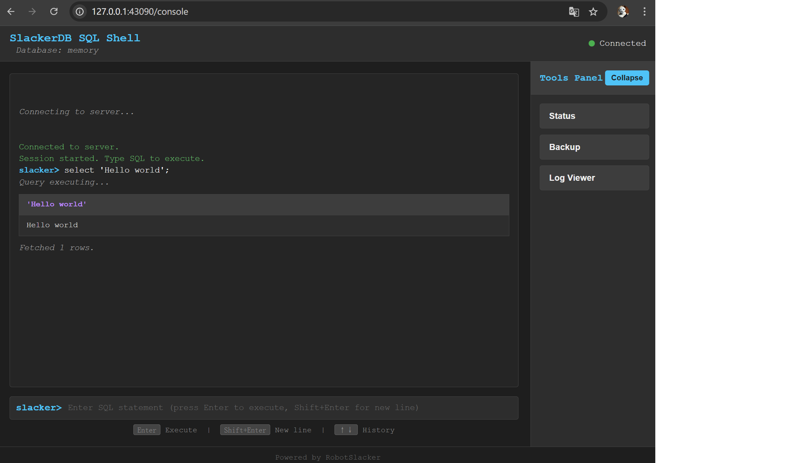

.RobotSlacker


== SlackerDB (DuckDB Postgres proxy)

==== What is SlackerDB?

SlackerDB is a powerful, Java‑based extension that transforms DuckDB from a local, single‑process database into a fully networked, multi‑process data service platform. It bridges the gap between DuckDB's exceptional analytical performance and the connectivity requirements of modern applications.

===== Capabilities

* *Network‑Enabled DuckDB* – Breaks DuckDB's local‑only limitation by providing full TCP/IP network access, allowing remote clients to connect via standard PostgreSQL wire protocol.
* *Multi‑Process Support* – Enables concurrent access from multiple processes and applications, overcoming DuckDB's single‑process restriction.
* *PostgreSQL Protocol Compatibility* – Implements the PostgreSQL wire protocol, making DuckDB accessible through any PostgreSQL‑compatible client (JDBC, ODBC, libpq, psql, etc).
* *High‑Performance Data Import* – Supports PostgreSQL COPY syntax for bulk data loading with performance comparable to native DuckDB imports.
* *Dual‑Layer Architecture* – Provides both a direct database server (`dbserver`) and a connection proxy (`dbproxy`) for load balancing and high availability.
* *Embeddable Design* – Can be embedded directly into Java applications as a library, or run as standalone servers.
* *Flexible Deployment* – Supports multiple deployment models: standalone server, embedded library.
* *Plugin System* – Extensible PF4J‑based plugin framework for custom functionality, HTTP endpoints, and integration with external systems.
* *Data Encryption* – Leverages DuckDB's native encryption for secure data‑at‑rest protection.

===== Data Service Platform

* *RESTful Data APIs* – Exposes database operations through comprehensive REST APIs, enabling integration with web applications, microservices, and serverless architectures.
* *Self‑Managed Services* – Allows dynamic registration and management of data services at runtime without server restarts.
* *SQL‑as‑a‑Service* – Transform SQL queries into reusable, parameterized API endpoints with built‑in caching and security controls.


===== Use Cases

* *Analytical Application Backends* – Serve as the data engine for BI tools, dashboards, and reporting applications.
* *Edge Computing* – Lightweight, embeddable database for edge devices and IoT OLAP applications.

SlackerDB combines DuckDB's analytical prowess with network connectivity, making it the ideal solution for modern data‑driven applications that require both high performance and flexible access patterns.

=== Usage

==== Build from source:

....
    # make sure you have JDK17 and maven 3.6+ ready.
    # Download source code
    git clone ...
    # compile it
    cd slackerdb
    mvn clean compile package -Dmaven.test.skip=true

    # All compiled results will be placed in the dist directory.
    #    compiled Jar packages,
    #    source jar packages
    #    default configuration files.
....

==== Start db server

....
    java -jar dbserver/target/slackerdb-dbserver-0.2.1-standalone.jar start
....

==== Stop db server

....
    java -jar dbserver/target/slackerdb-dbserver-0.2.1-standalone.jar stop
....

==== Check db status

....
    java -jar dbserver/target/slackerdb-dbserver-0.2.1-standalone.jar status
....

==== Start db proxy

....
    java -jar dbproxy/target/slackerdb-dbproxy-0.2.1-standalone.jar start
....

==== Stop db proxy

....
    java -jar dbproxy/target/slackerdb-dbproxy-0.2.1-standalone.jar stop
....

==== Check proxy status

....
    java -jar dbproxy/target/slackerdb-dbproxy-0.2.1-standalone.jar status
....

==== Server configuration file template

....
# Database name, default is none.
data=

# Path where data files are saved
# ":memory:" indicates in-memory mode (data will be lost after restart)
data_dir=:memory:

# Temporary files directory during operations
# Disk mode:   Defaults to data_dir if not specified
# Memory mode: Defaults to system temp directory if not specified
# Recommended: Use high-performance storage for temp_dir
temp_dir=

# Directory for extension plugins
# Default: $HOME/.duckdb/extensions
extension_dir=

# Directory for custom plugins
# Default: None
plugins_dir=

# Run as background daemon (true/false)
daemon=

# PID file location
# - Locks exclusively during server operation
# - Startup aborts if file is locked by another process
# - No file created if not configured, and no lock.
pid=

# Log output destinations (comma-separated)
# "CONSOLE" for stdout, file paths for file logging
log=CONSOLE,logs/slackerdb.log

# Log verbosity level
log_level=INFO

# Main service port
# 0 = random port assignment
# -1 = disable network interface
# Default: 0 (disabled)
port=

# Used to indicate whether data encryption is enabled.
# If enabled, a key must be provided before accessing the database.
# default: false
data_encrypt=false

# Data service API port
# 0 = random port assignment
# -1 = disable interface (default)
port_x=

# Network binding address
bind=0.0.0.0

# Client connection idle timeout (seconds)
client_timeout=600

# External remote listener registry endpoint
# Format: IP:PORT
# Default: none (disabled)
remote_listener=

# Database opening mode.
# Default: READ_WRITE
access_mode=READ_WRITE

# Maximum concurrent connections
# Default: 256
max_connections=

# Maximum worker threads
# Default: CPU core count
max_workers=

# Business processing threads (executes SQL off the Netty I/O threads)
# Default: -1 = follow max_connections (one business thread per session)
#   0 = disabled (run SQL on the I/O threads; a slow query will block other
#       connections sharing the same I/O thread)
#  >0 = explicit thread count
# Note: connections sharing one business thread still queue behind each other.
# The number of connections affected by a slow query is about
# (connections / business_threads - 1), so keep this close to the number of
# concurrently active sessions.
business_threads=

# Database engine threads
# Default: memory_limit (GB) / 10 (minimum 1)
# Recommendation: adjust based on workload
threads=

# Auto workload threshold for memory limit calculation
# Value range: >0 and <=1, default: 0.8
# Used to compute default memory_limit if memory_limit is not set
auto_workload_threshold=

# Memory usage limit (K/M/G suffix)
# Default: 80% of total system memory
# -1 = unlimited (memory mode only)
memory_limit=

# Database template file
template=

# Initialization script(s)
# Executes only on first launch
# Accepts: .sql file or directory
init_script=

# Startup script(s)
# Executes on every launch
# Accepts: .sql file or directory
startup_script=

# System locale
# Default: OS setting
locale=

# SQL command history
# ON = enable tracking
# OFF = disable (default)
sql_history=OFF

# Minimum idle connections in pool
connection_pool_minimum_idle=3

# Maximum idle connections in pool
connection_pool_maximum_idle=10

# Connection lifetime (milliseconds)
connection_pool_maximum_lifecycle_time=900000

# Query result cache configuration (in bytes)
# - Only caches API request results (JDBC queries unaffected)
# - Default: 1GB (1073741824 bytes)
# - Set to 0 to disable caching
query_result_cache_size=

# Data service history
# ON = enable tracking
# OFF = disable (default)
data_service_history=

# Data service schema initialization file/path
# - Accepts:
#   * JSON file path (single schema)
#   * Directory path (loads all *.service files)
# - Schema files should contain service definitions in JSON format
data_service_schema=

# MCP configuration file/path
# Specifies the Model Context Protocol configuration file for dynamic tool/resource loading.
# - Accepts:
#   * JSON file path (single config)
#   * Directory path (loads all *.mcp files)
# Default: empty (no MCP configuration)
mcp_config=

# MCP LLM server configuration
# Format: <service>:<ip>:<port>:<model>
# Example: openai:api.openai.com:443:gpt-4
# Default: empty (no LLM server configuration)
mcp_llm_server=

# MCP LLM API key for services that require authentication
# Required for OpenAI API and optional for other services
# Example: sk-xxxxxxxxxxxxxxxxxxxxxxxxxxxxxxxx
# Default: empty (no API key)
mcp_llm_key=

# Unix Domain Socket file path
# Used for UDS (Unix Domain Socket) connections instead of TCP
# Default: empty (UDS disabled, use TCP)
# Note: Only supported on Linux/macOS. Ignored on Windows.
socket=
....

==== Proxy configuration file template

....
# PID file location
# - Locks exclusively during server operation
# - Startup aborts if file is locked by another process
# - No file created if not configured, and no lock.
pid=

# Log output destinations (comma-separated)
# "CONSOLE" for stdout, file paths for file logging
log=CONSOLE,logs/slackerdb-proxy.log

# Log level
log_level=INFO

# Run as background daemon (true/false)
daemon=

# Main service port
# 0 = random port assignment
# -1 = disable network interface
# Default: 0 (disabled)
port=0

# Data service API port
# 0 = random port assignment
# -1 = disable interface (default)
port_x=0

# Network binding address
bind=0.0.0.0

# Client connection idle timeout (seconds)
client_timeout=600

# Maximum worker threads
# Default: CPU core count
max_workers=

# Business processing threads (executes SQL off the Netty I/O threads)
# Default: -1 = follow max_connections (one business thread per session)
#   0 = disabled (run SQL on the I/O threads); >0 = explicit thread count
business_threads=

# Database engine threads
# Default: memory_limit (GB) / 10 (minimum 1)
# Recommendation: adjust based on workload
threads=

# Auto workload threshold for memory limit calculation
# Value range: >0 and <=1, default: 0.8
# Used to compute default memory_limit if memory_limit is not set
auto_workload_threshold=

# Memory usage limit (K/M/G suffix)
# Default: 80% of total system memory
# -1 = unlimited (memory mode only)
memory_limit=

# System locale
# Default: OS setting
locale=
....

Note: All parameters are optional. +
You can keep only the parameters you need to modify. +
For parameters that are not configured, default values will be used.

==== JDBC Support

SlackerDB provides full PostgreSQL wire protocol compatibility, allowing you to connect using standard JDBC drivers. This enables you to use any PostgreSQL‑compatible JDBC client, including the native SlackerDB JDBC driver for optimal integration.

*PostgreSQL JDBC Driver*
You can use the standard PostgreSQL JDBC driver (`org.postgresql.Driver`) with the connection URL format `jdbc:postgresql://host:port/database`. This is useful when you want to reuse existing PostgreSQL tooling.

*SlackerDB JDBC Driver*
For better integration and additional features, use the native SlackerDB JDBC driver (`org.slackerdb.jdbc.Driver`). The connection URL format is `jdbc:slackerdb://host:port/database`. This driver is included in the distribution and is recommended for new applications.

*Connection Examples*

....
// PostgreSQL JDBC driver
String url = "jdbc:postgresql://127.0.0.1:3175/db1";
Connection conn = DriverManager.getConnection(url, "main", "");
conn.setAutoCommit(false);

// SlackerDB JDBC driver
String url = "jdbc:slackerdb://127.0.0.1:3175/db1";
Connection conn = DriverManager.getConnection(url, "main", "");
conn.setAutoCommit(false);
....

*IDE Integration*

You can connect to SlackerDB from database tools DBeaver. (For other tools, we have not verified it.) +
*Use PostgreSQL driver* +
Download postgresql server and connect database like a pg.

*Use custom driver* +
Since native Postgres clients often use some data dictionary information
that duckdb doesn’t have, +
You can create a generic JDBC driver with the following settings: +

....
Dbeaver:
Database -> Driver Manager -> New
   Database type: generic database.
   Class name:    org.slackerdb.jdbc.Driver
   URL template:  jdbc:slackerdb://{host}:{port}/[{database}]
....


*ODBC and Python*
SlackerDB also supports ODBC and Python connections via the same PostgreSQL wire protocol. Refer to the respective client documentation for setup details.

==== Unix Domain Socket (UDS) Support

SlackerDB supports Unix Domain Socket (UDS) connections for local inter-process communication. UDS provides lower latency and higher throughput compared to TCP loopback connections, making it ideal for local client-server communication on the same machine.

NOTE: UDS is only supported on Linux and macOS. On Windows, the `socket` parameter is ignored and a log message is printed.

===== Server Configuration

You can enable UDS by setting the `socket` parameter in the server configuration file:

....
# dbserver/conf/dbserver.conf
socket=/tmp/.s.slackerdb.4309
....

Alternatively, use the `--socket` command-line parameter:

....
java -jar dbserver/target/slackerdb-dbserver-0.2.1-standalone.jar start --socket /tmp/.s.slackerdb.4309
....

When `socket` is configured, the server listens on both the TCP port and the UDS socket simultaneously. Clients can connect via either method.

===== JDBC Connection via UDS

To connect to SlackerDB via UDS using the SlackerDB JDBC driver, use the `jdbc:slackerdb://` protocol with the `socketFactory` and `socketFactoryArg` connection parameters:

....
// SlackerDB JDBC driver with UDS
String url = "jdbc:slackerdb:///mem";
Properties props = new Properties();
props.setProperty("user", "");
props.setProperty("password", "");
props.setProperty("socketFactory",
        "org.slackerdb.jdbc.UnixDomainSocketFactory");
props.setProperty("socketFactoryArg", "/tmp/.s.slackerdb.4309");

Connection conn = DriverManager.getConnection(url, props);
conn.setAutoCommit(false);
....

The `UnixDomainSocketFactory` class is included in the SlackerDB JDBC driver and uses Java's built-in `UnixDomainSocketAddress` API (Java 16+) to establish UDS connections.

Key points:
* The `socketFactory` parameter must be set to `org.slackerdb.jdbc.UnixDomainSocketFactory`
* The `socketFactoryArg` parameter specifies the UDS socket file path
* The `jdbc:slackerdb://` protocol is used (not `jdbc:postgresql://`)
* The host portion of the URL is ignored when using UDS; use `///database` format

==== Basic Services
The following HTTP endpoints provide basic administrative functions, such as backup, file upload/download, log viewing, and status monitoring. These endpoints are available when the Data Services API port (port_x) is enabled.

===== /backup (POST)

Performs a database backup. The backup file is saved in the `backup/` directory with the naming pattern `\{database\}_\{backupTag\}.db`.

.Request body (JSON):
[source,json]
----
{
  "backupTag": "mybackup"
}
----

.Response example (success):
[source,json]
----
{
  "retCode": 0,
  "retMsg": "Successful. Backup file has placed to [C:\\Work\\slackerdb\\backup\\mydb_mybackup.db]."
}
----

===== /download (GET)

Downloads a file from the server's working directory.

.Query parameters:
* `filename` (required) – relative path to the file.

.Example:
 GET /download?filename=logs/slackerdb.log

The endpoint supports Range requests for partial downloads.

===== /upload (POST)

Uploads a file to the server's working directory.

.Query parameters:
* `filename` (required) – target file path.

.Form data:
* `file` (required) – the file to upload.

.Example using curl:
[source,bash]
----
curl -X POST -F "file=@local.txt" "http://localhost:8080/upload?filename=uploads/remote.txt"
----

.Response:
[source,json]
----
"uploaded: C:\\Work\\slackerdb\\uploads\\remote.txt"
----

===== /viewLog (GET)

Retrieves the last N lines of a log file.

.Query parameters:
* `filename` (required) – path to the log file.
* `lines` (optional) – number of lines to return (default 100, max 10000).

.Example:
 GET /viewLog?filename=logs/slackerdb.log&lines=50

.Response (JSON array of strings):
[source,json]
----
[
  "2025-12-04 10:00:00 INFO  Server started",
  "2025-12-04 10:00:01 INFO  Listening on port 8080"
]
----

===== /status (GET)

Returns comprehensive server status information, including server details, database metrics, configuration parameters, usage statistics, installed extensions, and active sessions.

.Example:
 GET /status

.Response (abbreviated):
[source,json]
----
{
  "server": {
    "status": "RUNNING",
    "version": "0.2.1",
    "build": "2025-12-04 10:00:00.000 UTC",
    "pid": 12345,
    "now": "2025-12-04 15:20:00",
    "bootTime": "2025-12-04 10:00:00",
    "runTime": "5 hours, 20 minutes, 0 seconds"
  },
  "database": {
    "version": "v1.0.0",
    "size": "1.2 GB",
    "memoryUsage": "256 MB",
    "walSize": "0 B"
  },
  "parameters": {},
  "usage": {},
  "extensions": [],
  "sessions": []
}
----

==== PL/SQL Support

SlackerDB ships a PL/SQL engine for **anonymous blocks**: declare variables, branch, loop, iterate
cursors, fetch into variables and handle exceptions — all on top of DuckDB.

===== Running a block

Wrap the block in `DO $$ ... $$` (PostgreSQL style) and send it like any other statement:

[source,sql]
----
DO $$
DECLARE
    CURSOR cur IS SELECT id, name FROM users WHERE active = true;
    v_id   BIGINT;
    v_name TEXT;
    total  INTEGER := 0;
BEGIN
    OPEN cur;
    LOOP
        FETCH cur INTO v_id, v_name;
        EXIT WHEN cur%NOTFOUND;

        IF v_name IS NULL THEN
            CONTINUE;
        ELSIF length(v_name) > 20 THEN
            UPDATE users SET name = substr(:v_name, 1, 20) WHERE id = :v_id;
        ELSE
            INSERT INTO audit(user_id, note) VALUES (:v_id, 'ok: ' || :v_name);
        END IF;

        total := total + 1;
        EXIT WHEN total >= 1000;
    END LOOP;
    CLOSE cur;
EXCEPTION
    WHEN NO_DATA_FOUND THEN
        INSERT INTO audit(user_id, note) VALUES (NULL, 'no rows');
    WHEN OTHERS THEN
        ROLLBACK;
        RAISE;
END;
$$;
----

Supported wrappers: `DO $$ ... $$`, `DO $tag$ ... $tag$`, bare `$$ ... $$`, and unwrapped
`DECLARE ... BEGIN ... END;` scripts (the latter needs a client that does not split statements —
see *Client notes* below). One query string may contain several statements; they run in order.

===== Typical examples

The four blocks below are **self-contained**: each one creates its own tables, so you can paste any
of them into a client and run it as is. Two conventions to keep in mind: in the structural part
(`IF`, `WHILE`, `FETCH INTO`, assignments) variables can be written bare; while **variables inside
embedded SQL must be written as `:name`** (bind parameters).

*Variables, `IF`/`ELSIF` branching and a `WHILE` loop*:

[source,sql]
----
DO $$
DECLARE
    i     INTEGER := 1;
    total INTEGER := 0;
BEGIN
    CREATE OR REPLACE TABLE demo_numbers(n INTEGER, kind TEXT);

    WHILE i <= 6 LOOP
        IF i % 2 = 0 THEN
            INSERT INTO demo_numbers VALUES (:i, 'even');
        ELSIF i % 3 = 0 THEN
            INSERT INTO demo_numbers VALUES (:i, 'multiple of 3');
        ELSE
            INSERT INTO demo_numbers VALUES (:i, 'other');
        END IF;
        total := total + i;
        i := i + 1;
    END LOOP;

    INSERT INTO demo_numbers VALUES (:total, 'sum');
END;
$$;
----

Result: `demo_numbers` holds six classified rows (`other` / `even` / `multiple of 3`) plus the
summary row `(21, 'sum')`.

*Walking a cursor with `%NOTFOUND`, plus an exception handler*:

[source,sql]
----
DO $$
DECLARE
    CURSOR cur IS SELECT id, name FROM demo_emp ORDER BY id;
    v_id    INTEGER;
    v_name  TEXT;
    v_total INTEGER := 0;
BEGIN
    CREATE OR REPLACE TABLE demo_emp(id INTEGER, name TEXT);
    INSERT INTO demo_emp VALUES (1, 'alice'), (2, 'bob'), (3, 'carol');
    CREATE OR REPLACE TABLE demo_audit(id INTEGER, note TEXT);

    OPEN cur;
    LOOP
        FETCH cur INTO v_id, v_name;
        EXIT WHEN cur%NOTFOUND;

        IF v_name IS NULL THEN
            CONTINUE;
        END IF;

        INSERT INTO demo_audit VALUES (:v_id, 'ok: ' || :v_name);
        v_total := v_total + 1;
    END LOOP;
    CLOSE cur;

    INSERT INTO demo_audit VALUES (0, 'count = ' || CAST(:v_total AS TEXT));
EXCEPTION
    WHEN OTHERS THEN
        INSERT INTO demo_audit VALUES (-1, 'failed');
END;
$$;
----

Result: `demo_audit` receives three `ok: <name>` rows for ids `1/2/3`, plus `(0, 'count = 3')`.

*`SELECT ... INTO` with an exception handler that branches on the error code*:

[source,sql]
----
DO $$
DECLARE
    v_name TEXT;
    v_cnt  INTEGER;
BEGIN
    CREATE OR REPLACE TABLE demo_dept(id INTEGER, name TEXT);
    INSERT INTO demo_dept VALUES (1, 'sales'), (2, 'hr');

    SELECT count(*) INTO v_cnt FROM demo_dept;

    BEGIN
        SELECT name INTO v_name FROM demo_dept WHERE id = 99;
    EXCEPTION
        WHEN NO_DATA_FOUND THEN
            v_name := '(not found)';
        WHEN TOO_MANY_ROWS THEN
            v_name := '(too many rows)';
    END;

    CREATE OR REPLACE TABLE demo_result(cnt INTEGER, name TEXT);
    INSERT INTO demo_result VALUES (:v_cnt, :v_name);
END;
$$;
----

Result: `demo_result` holds `(2, '(not found)')` — when the query matches no row, `SELECT INTO`
raises `NO_DATA_FOUND`, which the inner block catches.

*Dynamic SQL: `EXECUTE IMMEDIATE` with `USING` and `INTO`*:

[source,sql]
----
DO $$
DECLARE
    v_table TEXT := 'demo_dyn';
    v_id    INTEGER := 7;
    v_cnt   INTEGER;
BEGIN
    EXECUTE IMMEDIATE 'CREATE OR REPLACE TABLE ' || v_table || '(id INTEGER)';
    EXECUTE IMMEDIATE 'INSERT INTO ' || v_table || ' VALUES (?)' USING v_id;
    EXECUTE IMMEDIATE 'SELECT count(*) FROM ' || v_table INTO v_cnt;
    EXECUTE IMMEDIATE 'INSERT INTO ' || v_table || ' VALUES (?)' USING v_cnt * 10;
END;
$$;
----

Result: `demo_dyn` holds the two rows `7` and `10`; `USING` values bind to the placeholders in the
order they appear (`?`, `:1` and `:name` all work, and `:name` also resolves from the current scope
when there is no `USING` clause).

===== What is supported

[cols="22%,78%",options="header",]
|===
|Area |Supported

|Declaration |`DECLARE` variables with `INTEGER`/`SMALLINT`/`BIGINT`/`DECIMAL(p,s)`/`REAL`/`DOUBLE`/`VARCHAR(n)`/`CHAR(n)`/`TEXT`/`BOOLEAN`/`DATE`/`TIME`/`TIMESTAMP [WITH TIME ZONE]`/`INTERVAL`, `NOT NULL`, defaults, and `CURSOR name [(params)] IS <query>`

|Assignment |`x := expr;` and `LET x = expr;`

|Conditionals |`IF / ELSIF / ELSE / END IF` (also `ELSEIF`, `ENDIF`, `==`, `!=`, `&&`, `!`)

|Loops |`LOOP`, `WHILE cond LOOP`, `FOR i IN [REVERSE] a..b LOOP` (inclusive), `FOR i IN [v1, v2] LOOP`, `EXIT [WHEN cond]`, `CONTINUE [WHEN cond]`, labelled loops

|Cursors |`OPEN` / `FETCH ... INTO` / `CLOSE`, `%FOUND`, `%NOTFOUND`, `%ROWCOUNT`, `%ISOPEN`

|Queries |`SELECT ... INTO v1[, v2]` (exactly one row), any DuckDB SQL statement, `:name` bind variables in SQL text

|Dynamic SQL |`EXECUTE IMMEDIATE <SQL text> [INTO targets...] [USING values...]`: the SQL text is evaluated at run time (build it with `\|\|`), placeholders may be `?` / `:1` / `:name`, and `USING` binds them in order of appearance; without `INTO` a result set is discarded, with `INTO` single-row semantics apply (`NO_DATA_FOUND` / `TOO_MANY_ROWS` / `24000`), and a placeholder/`USING` count mismatch raises `07001`

|Exceptions |`EXCEPTION WHEN NO_DATA_FOUND / TOO_MANY_ROWS / ZERO_DIVIDE / OTHERS / <custom> THEN`, `RAISE`, `RAISE name`, re-raise inside a handler, nested blocks (legacy `EXCEPTION:` = `WHEN OTHERS`)

|Expressions |Arithmetic, `\|\|` concatenation, comparisons, `IS [NOT] NULL`, `LIKE`, `IN`, `BETWEEN`, `CASE`, logical `AND`/`OR`/`NOT` with short-circuit, and any DuckDB function
|===

===== Semantics worth knowing

* Variables start as `NULL` (not `0`).
* `FOR i IN 1..5` iterates **1,2,3,4,5** (both bounds inclusive); `FOR i IN 5..1` iterates 0 times;
  `FOR i IN REVERSE 5..1` iterates 5,4,3,2,1.
* `EXIT` leaves only the innermost loop; `EXIT label` leaves the named loop.
* `SELECT ... INTO` with 0 rows raises `NO_DATA_FOUND`, with more than one row `TOO_MANY_ROWS` —
  it never silently picks a row.
* `:name` inside **string literals** is not substituted (`'Hello :name'` is literal text; use `||`).
* Expressions are evaluated with **bind parameters** — values are never spliced into SQL text.
* Division by zero raises `ZERO_DIVIDE`, so `WHEN ZERO_DIVIDE` works.
* A block never returns a result set; write results to tables instead.
* Runaway loops are stopped by a statement budget (200000 statements) → `54000`.

===== Error codes

[cols="22%,78%",options="header",]
|===
|SQLSTATE |Meaning

|`42601` |Syntax or semantic error (unknown variable/cursor, duplicate declaration, unsupported type) — reported with `line:column`
|`P0002` / `P0003` |`NO_DATA_FOUND` / `TOO_MANY_ROWS`
|`22012` |`ZERO_DIVIDE`
|`22001` / `22003` / `22P02` / `22007` / `42804` |String too long / numeric out of range / bad numeric text / bad datetime / datatype mismatch
|`24000` |Invalid cursor state; `INTO` target count mismatch
|`P0001` |User `RAISE`
|`57014` |Canceled by `CancelRequest` / `KILL SESSION` (long PL/SQL loops are interruptible)
|`54000` |Statement budget exceeded (possible infinite loop)
|===

===== Client notes

A PL/SQL block must reach the server **unsplit**. SlackerDB's own JDBC driver splits statements on
top-level semicolons in the extended protocol; it understands dollar quoting, so `DO $$ ... $$` is
sent as one statement while an unwrapped `DECLARE ... END;` block is not.

[cols=",",options="header",]
|===
|Block form |Extended protocol (default) |Simple query protocol (`preferQueryMode=simple`, psql)

|`DO $$ ... $$` |OK |OK
|bare `$$ ... $$` |OK |OK
|unwrapped `DECLARE ... END;` |split by the driver — use `DO $$` instead |OK
|===

===== Types and implicit conversion

Variables are typed at declaration. Every assignment converts the value to the declared type with
these rules:

[cols="30%,70%",options="header",]
|===
|Source → target |Result

|NULL → any |OK (stays NULL)
|between numeric types |OK; widening is lossless, narrowing rounds half-up, **overflow raises `22003`**
|string → numeric/date/time/timestamp |OK when the text parses as that literal, otherwise `22P02` (or `22007` for datetime)
|numeric/date/time/timestamp → string |OK (standard text form)
|string → `VARCHAR(n)`/`CHAR(n)` when longer than `n` |**`22001` — never silently truncated**
|anything involving `BOOLEAN` (except NULL) |`42804` — use an explicit function or `CAST`
|anything else |`42804`
|===

Identifiers are case-insensitive and folded to lower case unless quoted (`"Mixed"` keeps its case).
An uninitialised variable is `NULL`; `NOT NULL` declarations reject NULL assignment (`22004`).

===== Loop boundaries

[cols="45%,55%",options="header",]
|===
|Form |Iterations

|`FOR i IN 1..1` |1 (i = 1)
|`FOR i IN 1..5` |5 — **both bounds inclusive**
|`FOR i IN 1..0`, `FOR i IN 5..1` |0
|`FOR i IN REVERSE 5..1` |5 → 5,4,3,2,1
|`FOR i IN REVERSE 1..5` |0
|`FOR i IN -3..-1` |3 → -3,-2,-1
|`FOR i IN [v1, v2, v3]` |one iteration per list element (compatibility form)
|`WHILE NULL LOOP` |0 (NULL counts as false)
|`LOOP` that never exits |stopped by the statement budget → `54000`
|===

The loop variable is implicit, read-only, and invisible outside the loop. `EXIT` / `CONTINUE`
affect only the innermost loop; `EXIT name` leaves the loop that carries that label:

[source,sql]
----
<<outer_loop>>
LOOP
    ...
    EXIT outer_loop WHEN done = 1;
END LOOP outer_loop;
----

===== Expression semantics

* Precedence, high to low: `**` → unary `-` / `NOT` → `* / %` → `+ -` → `||` → comparisons
  (`= <> < <= > >=`, `IS [NOT] NULL`, `LIKE`, `IN`, `BETWEEN`) → `AND` → `OR`.
* `NULL` in a condition counts as false; `AND`/`OR` short-circuit, so `false AND (1/0 = 1)` is fine.
* `||` is **string concatenation** (SQL semantics) — write `OR` for logical or.
* Every variable value is passed as a bind parameter; values are never spliced into SQL text.
* Function calls are delegated to DuckDB, so any DuckDB scalar function works (qualified names such
  as `schema.func` are accepted).

Compatibility aliases kept from earlier versions:

[cols="30%,70%",options="header",]
|===
|Alias |Equivalent

|`LET x = e` |`x := e`
|`PASS` |`NULL;`
|`BREAK` |`EXIT`
|`==` `!=` `&&` `!` |`=` `<>` `AND` `NOT`
|`ELSEIF` / `ENDIF` |`ELSIF` / `END IF`
|`EXCEPTION:` + statements |`EXCEPTION WHEN OTHERS THEN`
|`FOR :i IN 1 TO 5` |`FOR i IN 1..5`
|`FOR i IN [v1, v2]` |list iteration
|`%notfound`, `%found`, `%rowcount`, `%isopen` |case-insensitive cursor attributes
|===

===== Cursor state machine

|===
|State \ operation |OPEN |FETCH |CLOSE |`%ISOPEN` |`%FOUND` |`%NOTFOUND` |`%ROWCOUNT`

|Closed (declared, not opened) |OK |`24000` |`24000` |false |`24000` |`24000` |`24000`
|Open, rows available |`24000` |OK, count+1 |OK |true |true |false |n
|Open, no rows |`24000` |OK → EOF, notFound=true |OK |true |false |true |0
|Open, after EOF |`24000` |OK (stays EOF, variables keep their values) |OK |true |false |true |n
|Closed after fetching |OK |`24000` |`24000` |false |`24000` |`24000` |`24000`
|===

A cursor opened in a block is closed automatically when that block ends (including on the exception
path); `CLOSE` followed by `OPEN` is allowed and resets `%ROWCOUNT`.

===== Statement routing

* Wrappers: `DO $$ … $$`, `DO $tag$ … $tag$`, bare `$$ … $$`, or an unwrapped `DECLARE … END;` script.
* Dollar quoting follows PostgreSQL: there are no escapes inside, the matching tag ends the string —
  use another tag (`$body$ … $body$`) when the body itself must contain `$$`.
* In the simple query protocol one query string may contain several statements separated by
  semicolons; they run in order and each returns its own `CommandComplete` (and result set).
* A PL/SQL block itself returns no rows: `CommandComplete` reports `DO`. Use `DESCRIBE`-visible
  statements (ordinary queries) or write into tables for output.
* In the extended protocol a PL/SQL portal is described as `NoData` and bound without parameters.

===== Limitations and known gaps

Stored procedures, functions, triggers, packages, records/`%ROWTYPE`, collections, cursor `FOR`
loops and `GOTO` are **not** supported. Unsupported constructs fail with an explicit error instead
of being silently ignored.

* `%FOUND` / `%NOTFOUND` applied to a name that is not a cursor is not rejected at compile time.
* Division by zero is detected when the divisor can be resolved locally (literal, variable, cursor
  attribute); a divisor computed by a query keeps the backend behaviour (`Infinity`).
* `TIMESTAMP WITH TIME ZONE` keeps the backend representation; values are not normalised to UTC.
* A block that fails does not roll back by itself — issue `ROLLBACK` in an `EXCEPTION` handler or
  from the client, exactly as with PostgreSQL `DO`.

===== How it works

A block is compiled before anything runs:

```
source text
  └─ detector          classify SQL / block / multi-statement script, unwrap DO $$ … $$
       └─ preparer     replace embedded SQL with equal-length placeholders (line/column preserved)
            └─ ANTLR    structure-only grammar (keywords, control flow, cursors, expressions)
                 └─ AST   statements + expression tree
                      └─ semantic check (unknown names, duplicates) before execution
                           └─ interpreter (scopes, cursors, exceptions, budget, cancellation)
```

Embedded SQL is never guessed by the parser and never re-written; expressions are compiled to
`SELECT <expr>` with bind parameters and cached per syntax node, while purely local expressions are
evaluated in the JVM (that is why a tight loop costs about a microsecond per iteration instead of a
database round trip).

The grammars live under `src/main/antlr4` — `plsql/src/main/antlr4/org/slackerdb/plsql/block/` for
the block structure and `dbserver/src/main/antlr4/org/slackerdb/dbserver/sql/antlr/` for `COPY`.
Nothing has to be generated by hand: the `antlr4-maven-plugin` runs during `generate-sources` and
writes the parsers into `target/generated-sources/antlr4`, which is registered as a compile source
root automatically. That is ordinary build output — `mvn clean` removes it and git never sees it — so
edit only the `.g4` files and let the next build regenerate the rest.

==== Data Service

* Data service work with port_x, please make sure you have enabled it in
server configuration or from command parameter. It’s important to note
that we have no consider on data security. This means data services must
work in a trusted environment.

===== user login

User login (note: this is optional). After success, a token will be
provided. +
Context operations or SQL access that requires context variables will
require token. +
If your program does not involve context feature, you can ignore this
login. +
Put it simplify, the token is currently used as the user ID.

[cols=",",options="header",]
|===
|Attribute |Value
|Protocol |HTTP
|Method |POST
|Path |`+/api/login+`
|===

Response example:

....
Success response (200)

  {
    "retCode": 0,
    "token": “yJhbGciOiJIUzI1NiIsInR5cCI6IkpXVCJ9”,
    "retMsg": "Login successful."
  }
....

===== user logout

User logout

[cols=",",options="header",]
|===
|Attribute |Value
|Protocol |HTTP
|Method |POST
|Path |`+/api/logout+`
|===

headers:

[cols=",",options="header",]
|===
|Attribute |Value
|Authorization |NzJjYjE3NmQtN2Y2ZC00OWMyLWIwODAtYTU1MDE3YzVmZDU1
|===

The token information here is obtained when call /login in earlier

Response example:

....
Success response (200)

  {
    "retCode": 0,
    "retMsg": "Successful."
  }
....

===== set context

set context

[cols=",",options="header",]
|===
|Attribute |Value
|Protocol |HTTP
|Method |POST
|Path |`+/api/setContext+`
|===

headers:

[cols=",",options="header",]
|===
|Attribute |Value
|Authorization |NzJjYjE3NmQtN2Y2ZC00OWMyLWIwODAtYTU1MDE3YzVmZDU1
|===

The token information here is obtained when call /login in earlier

request body:

[cols=",",options="header",]
|===
|Attribute |Value
|key1 |value1
|key2 |value2
|… |…
|keyx |valuex
|===

You can set one or more key-value pairs at once, or you can set multiple
key-value pairs by calling setContext multiple times.

Response example:

....
Success response (200)

  {
    "retCode": 0,
    "retMsg": "Successful."
  }
....

===== removeContext

remove context

[cols=",",options="header",]
|===
|Attribute |Value
|Protocol |HTTP
|Method |POST
|Path |`+/api/removeContext+`
|===

headers:

[cols=",",options="header",]
|===
|Attribute |Value
|Authorization |NzJjYjE3NmQtN2Y2ZC00OWMyLWIwODAtYTU1MDE3YzVmZDU1
|===

The token information here is obtained when call /login in earlier

request body:

[cols=",",options="header",]
|===
|Attribute |Value
|removedKeyList |[key1,key2, ….]
|===

You can remove one or more key-value pairs at once, or you can remove
multiple key-value pairs by calling removeContext multiple times.

Response example:

....
Success response (200)

  {
    "retCode": 0,
    "retMsg": "Successful."
  }
....

===== registerService

register a service

[cols=",",options="header",]
|===
|Attribute |Value
|Protocol |HTTP
|Method |POST
|Path |`+/api/registerService+`
|===

request body:

[width="100%",cols="20%,80%",options="header",]
|===
|Attribute |Value
|serviceName |service name

|serviceVersion |service version

|serviceType |service type, GET/POST

|searchPath |sql default search path, Optional parameter

|sql |SQL statement, can contain such $\{var1} variable information

|description |description

|snapshotLimit |how long the query result will be cached, Optional
parameter

|parameter |parameter default value when query api not provide parameter
value
|===

snapshotLimit format: 3 hours / 30 minutes / 45 seconds

Request example:

....
  {
    "serviceName": "queryTest1",
    "serviceVersion": "1.0",
    "serviceType": "GET",
    "sql": "SELECT 1"
  }
....

Response example:

....
Success response (200)

  {
    "retCode": 0,
    "retMsg": "Successful."
  }
....

===== unRegisterService

unregister a service

[cols=",",options="header",]
|===
|Attribute |Value
|Protocol |HTTP
|Method |POST
|Path |`+/api/unRegisterService+`
|===

request body:

[width="100%",cols="20%,80%",options="header",]
|===
|Attribute |Value
|serviceName |service name
|serviceVersion |service version
|serviceType |service type, GET/POST
|===

Request example:

....
  {
    "serviceName": "queryTest1",
    "serviceVersion": "1.0",
    "serviceType": "GET"
  }
....

Response example:

....
Success response (200)

  {
    "retCode": 0,
    "retMsg": "Successful."
  }
....

===== listRegisteredService

list all service

[cols=",",options="header",]
|===
|Attribute |Value
|Protocol |HTTP
|Method |GET
|Path |`+/api/listRegisteredService+`
|===

Response example:

....
Success response (200)

  {
    "retCode": 0,
    "retMsg": "Successful.",
    "services":
      {
        "Query1":
        {
          "serviceName" : "Query1",
          "serviceType" : "GET",
          ....
        }
      }
  }
....

===== /api/\{apiVersion}/\{apiName}

API query

[cols=",",options="header",]
|===
|Attribute |Value
|Protocol |HTTP
|Method |POST or GET
|Path |`+/api/{apiVersion}/{apiName}+`
|===

headers:

[width="100%",cols="18%,82%",options="header",]
|===
|Attribute |Value
|Authorization |NzJjYjE3NmQtN2Y2ZC00OWMyLWIwODAtYTU1MDE3YzVmZDU1

|snapshotLimit |Optional. used to overwrite service definition. 0 means
no result cache
|===

The token information here is obtained when call /login. +
The token is optional, if you use context in your sql statement, you
must set it. +
snapshotLimit format: 3 hours / 30 minutes / 45 seconds

GET Request example:

....
  GET /api/1.0/queryApi?context1=xxx&context2=yyy
....

POST Request example:

....
  POST /api/1.0/queryApi

  {
    "context1": "xxx",
    "context2": "yyy",
  }
....

Response example:

....
Success response (200)

  {
    "retCode": 0,
    "retMsg": "Successful.",
    "description": "test 1",
    "cached": false,
    "timestamp": 17777700,
    "data":
      {
        "columnNames":["col1","col2","col3"],
        "columnTypes":["INTEGER","INTEGER","VARCHAR"],
        "dataset":[[1,2,"中国"]]
      }
  }
....

==== MCP Tool

MCP (Model Context Protocol) Tool provides a way to register, manage, and invoke tools through the MCP protocol. These tools can be used by AI assistants and other clients that support MCP to perform specific operations or queries.

===== registerMCPTool

Register an MCP tool.

[cols=",",options="header",]
|===
|Attribute |Value
|Protocol |HTTP
|Method |POST
|Path |`+/mcp/registerMCPTool+`
|===

request body:

[width="100%",cols="20%,80%",options="header",]
|===
|Attribute |Value
|name |tool name (required)

|version |tool version (required)

|description |tool description (required)

|category |tool category (optional)

|capabilities |list of capabilities (optional array)

|use_cases |list of use cases (optional array)

|parameters |list of parameters (optional array of objects with name, type, required, description)

|examples |list of examples (optional array of objects with user_query, parameters)
|===

Request example:

....
  {
    "name": "queryDatabase",
    "version": "1.0",
    "description": "Execute SQL queries on the database",
    "category": "database",
    "capabilities": ["query", "execute"],
    "use_cases": ["data analysis", "report generation"],
    "parameters": [
      {
        "name": "sql",
        "type": "string",
        "required": true,
        "description": "SQL query to execute"
      }
    ],
    "examples": [
      {
        "user_query": "Get all customers from the database",
        "parameters": {"sql": "SELECT * FROM customers"}
      }
    ]
  }
....

Response example:

....
Success response (200)

  {
    "retCode": 0,
    "retMsg": "Tool registered successfully"
  }
....

===== unregisterMCPTool

Unregister an MCP tool.

[cols=",",options="header",]
|===
|Attribute |Value
|Protocol |HTTP
|Method |POST
|Path |`+/mcp/unregisterMCPTool+`
|===

request body:

[width="100%",cols="20%,80%",options="header",]
|===
|Attribute |Value
|name |tool name (required)
|===

Request example:

....
  {
    "name": "queryDatabase"
  }
....

Response example:

....
Success response (200)

  {
    "retCode": 0,
    "retMsg": "Tool unregistered successfully"
  }
....

===== loadMCPTool

Load MCP tool definitions from JSON.

[cols=",",options="header",]
|===
|Attribute |Value
|Protocol |HTTP
|Method |POST
|Path |`+/mcp/loadMCPTool+`
|===

request body: JSON array of tool definitions or a single tool definition object.

Response example:

....
Success response (200)

  {
    "retCode": 0,
    "retMsg": "Tools loaded successfully"
  }
....

===== saveMCPTool

Save MCP tool definitions to configuration file.

[cols=",",options="header",]
|===
|Attribute |Value
|Protocol |HTTP
|Method |POST
|Path |`+/mcp/saveMCPTool+`
|===

Response example:

....
Success response (200)

  {
    "retCode": 0,
    "retMsg": "Tools saved successfully",
    "savedPath": "/path/to/config/file"
  }
....

===== dumpMCPTool

Dump MCP tool definitions as JSON for download.

[cols=",",options="header",]
|===
|Attribute |Value
|Protocol |HTTP
|Method |POST
|Path |`+/mcp/dumpMCPTool+`
|===

Response: JSON file download with Content-Disposition header.

==== MCP Resource

MCP (Model Context Protocol) Resource provides a way to register, manage, and access resources through the MCP protocol. These resources can be used by AI assistants and other clients that support MCP to access data, files, or other resources.

===== registerMCPResource

Register an MCP resource.

[cols=",",options="header",]
|===
|Attribute |Value
|Protocol |HTTP
|Method |POST
|Path |`+/mcp/registerMCPResource+`
|===

request body:

[width="100%",cols="20%,80%",options="header",]
|===
|Attribute |Value
|name |resource name (required)

|type |resource type (required, e.g., "file", "database", "api")

|description |resource description (required)

|uri |resource URI or path (required)

|metadata |additional metadata (optional object)

|access_method |access method (optional, e.g., "read", "write", "both")
|===

Request example:

....
  {
    "name": "customerData",
    "type": "database",
    "description": "Customer database table",
    "uri": "duckdb://localhost/customers",
    "metadata": {
      "schema": "public",
      "table": "customers"
    },
    "access_method": "read"
  }
....

Response example:

....
Success response (200)

  {
    "retCode": 0,
    "retMsg": "Resource registered successfully"
  }
....

===== unregisterMCPResource

Unregister an MCP resource.

[cols=",",options="header",]
|===
|Attribute |Value
|Protocol |HTTP
|Method |POST
|Path |`+/mcp/unregisterMCPResource+`
|===

request body:

[width="100%",cols="20%,80%",options="header",]
|===
|Attribute |Value
|name |resource name (required)
|===

Request example:

....
  {
    "name": "customerData"
  }
....

Response example:

....
Success response (200)

  {
    "retCode": 0,
    "retMsg": "Resource unregistered successfully"
  }
....

===== loadMCPResource

Load MCP resource definitions from JSON.

[cols=",",options="header",]
|===
|Attribute |Value
|Protocol |HTTP
|Method |POST
|Path |`+/mcp/loadMCPResource+`
|===

request body: JSON array of resource definitions or a single resource definition object.

Response example:

....
Success response (200)

  {
    "retCode": 0,
    "retMsg": "Resources loaded successfully"
  }
....

===== saveMCPResource

Save MCP resource definitions to configuration file.

[cols=",",options="header",]
|===
|Attribute |Value
|Protocol |HTTP
|Method |POST
|Path |`+/mcp/saveMCPSource+`
|===

Response example:

....
Success response (200)

  {
    "retCode": 0,
    "retMsg": "Resources saved successfully",
    "savedPath": "/path/to/config/file"
  }
....

===== dumpMCPResource

Dump MCP resource definitions as JSON for download.

[cols=",",options="header",]
|===
|Attribute |Value
|Protocol |HTTP
|Method |POST
|Path |`+/mcp/dumpMCPSource+`
|===

Response: JSON file download with Content-Disposition header.

==== MCP Service

MCP (Model Context Protocol) Service provides a way to register, manage, and invoke services through the MCP protocol. These services can be used by AI assistants and other clients that support MCP.

===== registerMCPService

Register an MCP service.

[cols=",",options="header",]
|===
|Attribute |Value
|Protocol |HTTP
|Method |POST
|Path |`+/mcp/registerMCPService+`
|===

request body:

[width="100%",cols="20%,80%",options="header",]
|===
|Attribute |Value
|name |service name (required)

|apiName |API name (required)

|version |service version (required)

|method |service method, GET/POST (required)

|description |service description (required)

|category |service category (optional)

|capabilities |list of capabilities (optional array)

|use_cases |list of use cases (optional array)

|parameters |list of parameters (optional array of objects with name, type, required, description)

|examples |list of examples (optional array of objects with user_query, parameters)
|===

Request example:

....
  {
    "name": "queryCustomer",
    "apiName": "queryCustomer",
    "version": "1.0",
    "method": "GET",
    "description": "Query customer information",
    "category": "database",
    "capabilities": ["query", "filter"],
    "use_cases": ["customer lookup", "data analysis"],
    "parameters": [
      {
        "name": "customer_id",
        "type": "integer",
        "required": true,
        "description": "Customer ID to query"
      }
    ],
    "examples": [
      {
        "user_query": "Get customer with ID 123",
        "parameters": {"customer_id": 123}
      }
    ]
  }
....

Response example:

....
Success response (200)

  {
    "retCode": 0,
    "retMsg": "Service registered successfully"
  }
....

===== unregisterMCPService

Unregister an MCP service.

[cols=",",options="header",]
|===
|Attribute |Value
|Protocol |HTTP
|Method |POST
|Path |`+/mcp/unregisterMCPService+`
|===

request body:

[width="100%",cols="20%,80%",options="header",]
|===
|Attribute |Value
|name |service name (required)
|===

Request example:

....
  {
    "name": "queryCustomer"
  }
....

Response example:

....
Success response (200)

  {
    "retCode": 0,
    "retMsg": "Service unregistered successfully"
  }
....

===== loadMCPService

Load MCP service definitions from JSON.

[cols=",",options="header",]
|===
|Attribute |Value
|Protocol |HTTP
|Method |POST
|Path |`+/mcp/loadMCPService+`
|===

request body: JSON array of service definitions or a single service definition object.

Response example:

....
Success response (200)

  {
    "retCode": 0,
    "retMsg": "Services loaded successfully"
  }
....

===== saveMCPService

Save MCP service definitions to configuration file.

[cols=",",options="header",]
|===
|Attribute |Value
|Protocol |HTTP
|Method |POST
|Path |`+/mcp/saveMCPService+`
|===

Response example:

....
Success response (200)

  {
    "retCode": 0,
    "retMsg": "Services saved successfully",
    "savedPath": "/path/to/config/file"
  }
....

===== dumpMCPService

Dump MCP service definitions as JSON for download.

[cols=",",options="header",]
|===
|Attribute |Value
|Protocol |HTTP
|Method |POST
|Path |`+/mcp/dumpMCPService+`
|===

Response: JSON file download with Content-Disposition header.

==== SQL REPL Server

SQL REPL Server provides an asynchronous WebSocket interface for executing SQL queries and fetching results in pages.
It is useful for long-running queries where you want to avoid blocking the client, and aligns with the MCP (Model Context Protocol) philosophy of using WebSocket for bidirectional communication.

To use it, ensure the data service API port (port_x) is enabled in server configuration.

===== WebSocket Endpoint

Connect to the WebSocket endpoint:

[cols=",",options="header",]
|===
|Attribute |Value
|Protocol |WebSocket (ws:// or wss://)
|Path |`+/sql/ws+`
|===

Once connected, you can send JSON messages with the following general format:

....
{
  "id": "unique-request-id",   // used to match responses, echoed back unchanged
  "type": "message-type",      // one of: start, exec, fetch, cancel, close
  "data": { ... }              // payload specific to the message type; defaults to {}
}
....

The server replies with the same three fields: `id`, `type` (same as the request) and `data`.
There is **no** `retCode` / `retMsg` — success or failure is reported by `data.status`.
When a message fails validation or refers to an unknown session, the server replies with an error
object that carries neither `id` nor `type`:

....
{ "error": "Field 'sessionId' must be a string" }
....

Validation errors you may see: `Field 'id' must be a string`, `Field 'type' must be a string`,
`Field 'data' must be an object`, `Unknown type: <type>`, `Field 'sessionId' must be a string`,
`Field 'sql' must be a string`, `Field 'fetchSize' must be a number`,
`Field 'maxRows' must be a number`, `Invalid session`, `Invalid taskId`,
`Another SQL is already running`.

===== Session Management

A session is created by sending a `start` message. The server returns a `sessionId` that must be included in subsequent messages for the same session.

Start message:

....
{
  "id": "1",
  "type": "start",
  "data": {}
}
....

Response:

....
{
  "id": "1",
  "type": "start",
  "data": { "sessionId": "session-123" }
}
....

All further messages for this session must include `"sessionId": "session-123"` in their `data` field.

A session owns its own backend connection and can run **one task at a time**; sending `exec` while a
task is still running answers `{"error": "Another SQL is already running"}`.

===== Execute SQL (async)

Submits a SQL statement for asynchronous execution. Returns a task ID that can be used to fetch results later.

Message:

....
{
  "id": "2",
  "type": "exec",
  "data": {
    "sessionId": "session-123",
    "sql": "SELECT * FROM large_table",
    "fetchSize": 100   // optional, default 100; applied to the underlying Statement
  }
}
....

Response (returned as soon as the task is accepted, while it is still running):

....
{
  "id": "2",
  "type": "exec",
  "data": {
    "taskId": "550e8400-e29b-41d4-a716-446655440000",
    "status": "running"
  }
}
....

If the SQL fails while executing, the task status becomes `error` and `fetch` reports it as
`data.status = "error"` with the message in `data.error` (the `exec` response itself only means the
task was accepted).

===== Fetch Results

Retrieves a page of results for a given task ID. The endpoint returns a fixed number of rows (up to `fetchSize` specified in execute) and indicates whether more rows are available.

Message:

....
{
  "id": "3",
  "type": "fetch",
  "data": {
    "sessionId": "session-123",
    "taskId": "550e8400-e29b-41d4-a716-446655440000",
    "maxRows": 100   // optional, overrides the default page size
  }
}
....

Response:

....
{
  "id": "3",
  "type": "fetch",
  "data": {
    "status": "completed",
    "columns": ["id", "name"],
    "rows": [
      {"id": 1, "name": "Alice"},
      {"id": 2, "name": "Bob"}
    ],
    "hasMore": false,     // true while there are more rows
    "fetched": 2          // rows read so far for this task
  }
}
....

The values of `data.status` and the payload that comes with them:

* `running` — the task is still executing; the payload is **only** `{"status": "running"}`
  (there are no `rows` / `hasMore` yet);
* `error` — execution failed: `{"status": "error", "error": "<message>"}`;
* `completed` with a result set — `columns`, `rows`, `hasMore` and `fetched`; keep calling `fetch`
  while `hasMore` is true;
* `completed` without a result set (INSERT/UPDATE/DDL) — `{"status": "completed", "updateCount": <n>}`,
  with no `rows`;
* `idle` — the task has finished and its result set/statement have been closed (all rows consumed);
  a later `fetch` answers with this status.

You can send multiple `fetch` messages until `hasMore` becomes false. Each call returns the next page of rows.

===== Cancel Task

Cancels the task that is currently running in the session. Only `sessionId` is read — `taskId` is
ignored (a session has at most one running task): the server interrupts the executing thread and
calls `Statement.cancel()`.

Message:

....
{
  "id": "4",
  "type": "cancel",
  "data": {
    "sessionId": "session-123"
  }
}
....

Response:

....
{
  "id": "4",
  "type": "cancel",
  "data": {
    "status": "canceled",   // "no-running-statement" when there was nothing to cancel
    "detail": "statement canceled"
  }
}
....

When `status` is `canceled`, `detail` is either `"future canceled"` (the executing thread was
interrupted) or `"statement canceled"` (the running statement was cancelled); when there was nothing
to cancel, `status` is `no-running-statement` and `detail` is an empty string. A successful cancel
resets the task, so a later `fetch` with the old `taskId` answers `Invalid taskId`.

===== Close Session

Closes the session and releases all associated resources (including any pending tasks).

Message:

....
{
  "id": "5",
  "type": "close",
  "data": {
    "sessionId": "session-123"
  }
}
....

Response:

....
{
  "id": "5",
  "type": "close",
  "data": {
    "status": "closed"
  }
}
....

After closing, the session ID is no longer valid.

===== Example Workflow (using JavaScript/Node.js)

1. Connect to WebSocket endpoint:
+
[source,javascript]
----
const WebSocket = require('ws');
const ws = new WebSocket('ws://localhost:8080/sql/ws');
----

2. Create a session:
+
[source,javascript]
----
ws.send(JSON.stringify({
  id: "1",
  type: "start",
  data: {}
}));
----

3. Execute a long query:
+
[source,javascript]
----
ws.send(JSON.stringify({
  id: "2",
  type: "exec",
  data: {
    sessionId: "session-123",
    sql: "SELECT * FROM huge_table",
    fetchSize: 500
  }
}));
----

4. Fetch first page:
+
[source,javascript]
----
ws.send(JSON.stringify({
  id: "3",
  type: "fetch",
  data: {
    sessionId: "session-123",
    taskId: "abc123",
    maxRows: 100
  }
}));
----

5. Fetch subsequent pages until `hasMore` becomes false.

6. Optionally cancel (only `sessionId` is read — it cancels the session's current task):
+
[source,javascript]
----
ws.send(JSON.stringify({
  id: "4",
  type: "cancel",
  data: {
    sessionId: "session-123"
  }
}));
----

7. Close the session when done:
+
[source,javascript]
----
ws.send(JSON.stringify({
  id: "5",
  type: "close",
  data: {
    sessionId: "session-123"
  }
}));
----

*Note:* The examples above assume you handle incoming messages asynchronously. In a real client you would match responses by their `id`.

==== Web-based SQL Console



*Note: The web console is **not a production‑ready feature**. It is a demonstration tool designed to help you understand and verify the backend services (Data Service, MCP Tool, and MCP Resource) in a visual, interactive way.*

SlackerDB includes a web‑based SQL console that provides an interactive interface for executing SQL queries, viewing results, and performing administrative tasks directly from your browser. In addition to the core SQL REPL, the console offers dedicated panels for managing **Data Service**, **MCP Tool**, and **MCP Resource** – three key extension mechanisms of the SlackerDB ecosystem.

*Access:* After starting the server with the data‑service API port (`port_x`) enabled, open `http://<server>:<port_x>/console.html` in a modern browser.

*Features:*

* **Interactive SQL Shell:** Type SQL statements at the prompt and execute them with Enter. Command history is available with up/down arrows.
* **WebSocket Connection:** The console automatically connects to the SQL REPL server via WebSocket (`/sql/ws`) and manages sessions.
* **Tabular Results:** Query results are displayed as formatted tables with column names and types.
* **Sidebar Tools Panel:** Provides quick access to:
** *Server Status* – detailed modal with server metrics, database parameters, usage statistics, extensions, and active sessions.
** *Backup Database* – modal to create a backup with optional download of the resulting file.
** *Log Viewer* – modal to inspect server logs in real time.
* **Connection Indicator:** Visual indicator shows whether the console is connected to the server.
* **Asynchronous Execution:** Long‑running queries are executed asynchronously; results can be fetched in pages.
* **Data Service Management Panel:** Register, list, load, save, and unregister data services. You can also download the service definitions as a JSON file (the download will prompt you to choose a save location via the browser’s file‑picker dialog).
* **MCP Tool Management Panel:** List, load, save, and unregister MCP (Model Context Protocol) tools. Download the tool definitions as JSON (with file‑picker dialog).
* **MCP Resource Management Panel:** List, load, save, and unregister MCP resources. Download the resource definitions as JSON (with file‑picker dialog).

*Usage:*

1. Ensure the server is running with `port_x` configured (e.g., `port_x=8080`).
2. Navigate to `http://localhost:8080/console.html`.
3. The console will attempt to connect automatically. Once connected, you can start typing SQL.
4. Use the left‑sidebar buttons to switch between the **Console**, **Data Service**, **MCP Tool**, and **MCP Resource** views.
5. In each management panel you can:
   * Refresh the list of registered items.
   * Select items with checkboxes and perform batch operations (unregister, download).
   * Load definitions from a JSON file.
   * Save definitions to the server’s configuration directory.
   * Download definitions as a JSON file – the browser will show a file‑save dialog, allowing you to choose the location and filename.
6. Use the right‑sidebar buttons to open status, backup, or log modals.

The console is built with plain HTML/JavaScript and requires no additional installation. It is intended for development, testing, and administrative purposes in trusted environments. Its primary goal is to demonstrate how the backend services work and to provide a convenient way to experiment with the Data Service, MCP Tool, and MCP Resource subsystems.

==== Embed the db server in your code

....
  // create configuration,  and update as your need
  ServerConfiguration serverConfiguration = new ServerConfiguration();
  serverConfiguration.setPort(4309);
  serverConfiguration.setData("data1");

  // init database
  DBInstance dbInstance = new DBInstance(serverConfiguration);

  // startup database
  dbInstance.start();

  // shutdown database
  dbInstance.stop();

  // We currently supports starting multiple instances running at the same time.
  // But each instance must have his own port and instance name.
....

==== Embed the db proxy in your code

....
    ServerConfiguration proxyConfiguration = new ServerConfiguration();
    proxyConfiguration.setPort(dbPort);
    ProxyInstance proxyInstance = new ProxyInstance(proxyConfiguration);
    proxyInstance.start();

    // Waiting for server ready
    while (!proxyInstance.instanceState.equalsIgnoreCase("RUNNING")) {
        Sleeper.sleep(1000);
    }
....

==== Data Security
Based on DuckDB's secure encryption mechanism, we support data encryption.

To use this feature, you need to:

1. Set the parameter data_encrypt to true.
2. Set the database key through any of the following three methods:
     . Environment variable: SLACKERDB_<dbName>_KEY (where <dbName> is replaced with the name of your database instance).
     . Java property: Specify it when starting the program as -DSLACKERDB_<dbName>_KEY=....
     . After startup, specify it via the statement:  ALTER DATABASE <dbName> SET Encrypt Key <key>.


=== Known Issues

==== 1. User and password authorization

We do not support user password authentication, just for compatibility,
keep these two options. +
you can fill anything as you like, it doesn’t make sense.

==== 2. Limited support for duckdb datatype

Only some duckdb data types are supported, mainly simple types, such as
int, number, double, varchar, … Complex types are either still under
development or cannot be represented in the PG protocol (blob, list, map…),
and they are rejected with an explicit error rather than silently converted.

==== 3. postgresql-fdw

fdw will use "`Declare CURSOR`" to fetch remote data, while duck doesn’t
support this.

=== Plugin System

SlackerDB provides a PF4J‑based plugin framework that allows developers to extend the database server's functionality. Plugins can access database connections, loggers, and the Javalin web application instance, enabling them to register custom HTTP endpoints, execute background tasks, or integrate external services.

==== Plugin Mechanism Overview

The plugin system is built on top of PF4J (Plugin Framework for Java) and is customized to provide database‑specific context. The core components are:

* *DBPlugin* – Abstract plugin base class that extends PF4J's `Plugin` class and implements the `IDBPluginContext` interface. Plugins must extend this class and implement lifecycle methods.
* *DBPluginContext* – Plugin context object that contains a database connection, a logger, and the Javalin application instance. The plugin manager injects this context before the plugin starts.
* *DBPluginManager* – Custom plugin manager responsible for loading, starting, stopping, and unloading plugins. It uses a custom `DBPluginFactory` to ensure the context is automatically injected when a plugin is created.
* *DBPluginFactory* – Custom plugin factory that, after creating a plugin instance, checks whether the plugin implements `IDBPluginContext` and, if so, injects the `DBPluginContext`.

Plugin lifecycle:
1. *Load* – When the server starts, it scans the configured plugin directory (`plugins_dir`) and loads all JAR packages that conform to the PF4J specification.
2. *Create* – The plugin instance is created via `DBPluginFactory`, and the `DBPluginContext` is injected.
3. *Start* – The plugin's `start()` method is called, which executes `beforeStart()`, `onStart()`, and `afterStart()` in order.
4. *Run* – The plugin executes its custom logic in `onStart()`, e.g., registering Javalin routes, initializing database tables, etc.
5. *Stop* – When the server shuts down, the plugin's `stop()` method is called, executing `beforeStop()`, `onStop()`, and `afterStop()`.
6. *Delete* – When a plugin is unloaded, its `delete()` method is called, executing `beforeDelete()`, `onDelete()`, and `afterDelete()`.

Plugins can access the following resources:
* *Database connection* – Obtain a new connection to the backend database via `getDbConnection()` (created via `DuckDBConnection.duplicate()`).
* *Logger* – Obtain a configured SLF4J logger via `getLogger()`.
* *Web application instance* – Obtain the Javalin application instance via `getJavalinApp()`, which can be used to register HTTP routes and middleware.

==== How to Write a Plugin

The following steps are based on the `plugin‑example` module and demonstrate how to write a SlackerDB plugin.

===== 1. Create a Maven Project

The plugin project needs to depend on the `slackerdb‑plugin` module. Add the following dependency to your `pom.xml`:

[source,xml]
----
<dependency>
    <groupId>org.slackerdb</groupId>
    <artifactId>slackerdb-plugin</artifactId>
    <version>0.2.1</version>
    <scope>provided</scope>
</dependency>
----

The PF4J core library is also required (usually already a transitive dependency of `slackerdb‑plugin`).

===== 2. Implement the Plugin Main Class

Create a class that extends `DBPlugin` and implements the necessary lifecycle methods. Example:

[source,java]
----
package org.slackerdb.myplugin;

import io.javalin.Javalin;
import org.pf4j.PluginWrapper;
import org.slackerdb.plugin.DBPlugin;
import org.slf4j.Logger;

import java.sql.Connection;
import java.sql.SQLException;

public class MyPlugin extends DBPlugin {
    private Connection conn;
    private Javalin app;
    private Logger logger;

    public MyPlugin(PluginWrapper wrapper) {
        super(wrapper);
    }

    @Override
    protected void onStart() {
        // Obtain resources
        try {
            this.conn = getDbConnection();
        } catch (SQLException e) {
            // Handle exception
        }
        this.logger = getLogger();
        this.app = getJavalinApp();

        // Register a custom HTTP endpoint
        app.get("/myplugin/hello", ctx -> ctx.result("Hello from MyPlugin!"));

        // Initialize a database table
        try (var stmt = conn.createStatement()) {
            stmt.execute("CREATE TABLE IF NOT EXISTS myplugin_data (id INTEGER, name VARCHAR)");
        } catch (SQLException e) {
            logger.error("Failed to create table", e);
        }

        logger.info("MyPlugin started successfully");
    }

    @Override
    protected void onStop() {
        // Clean up resources
        if (conn != null) {
            try { conn.close(); } catch (SQLException ignored) {}
        }
        logger.info("MyPlugin stopped");
    }

    // Optional: override other lifecycle hook methods
    // beforeStart, afterStart, beforeStop, afterStop, beforeDelete, afterDelete
}
----

===== 3. Configure the Plugin Descriptor File

Create a `plugin.properties` file in the `src/main/resources` directory with the following content:

[source,properties]
----
# Plugin unique identifier, must match the plugin JAR filename (without extension)
plugin.id=myplugin

# Fully qualified name of the plugin main class, must extend org.slackerdb.plugin.DBPlugin
plugin.class=org.slackerdb.myplugin.MyPlugin

# Plugin version number, follows semantic versioning
plugin.version=1.0.0

# Plugin dependency requirement, * means no specific dependency
plugin.requires=*
----

===== 4. Build the Plugin

Package the plugin with Maven:

[source,bash]
----
mvn clean package
----

The resulting JAR file (e.g., `myplugin‑1.0.0.jar`) should contain the plugin class and the `plugin.properties` file.

===== 5. Deploy the Plugin

Place the plugin JAR file into the SlackerDB server's plugin directory (specified by the `plugins_dir` parameter in the configuration file, default is `$HOME/.slackerdb/plugins`). Ensure the directory exists and the server has read permission.

===== 6. Start the Server

Start the SlackerDB server; the plugin will be loaded and started automatically. Check the server logs to confirm successful plugin loading:

[source]
----
[SERVER][PLUGIN     ] Load plugin [myplugin] ...
[SERVER][PLUGIN     ] start plugin [myplugin] ...
----

If the plugin registered an HTTP endpoint, you can access it at `http://localhost:<port_x>/myplugin/hello` (assuming the management port `port_x` is enabled).

===== 7. Debugging Plugins

* *Logging* – Plugins can output logs via `getLogger()`; the log level is controlled by the server's `log_level` configuration.
* *Error handling* – Exceptions in plugin lifecycle methods are caught and wrapped as `RuntimeException`, causing the plugin to fail to start. Error messages are recorded in the server log.
* *Hot reload* – Hot reloading is not currently supported; you must restart the server after modifying a plugin.

==== Plugin Example

This section shows a complete, working plugin: its basic structure, resource access methods and
lifecycle. It is reproduced in full here so you can copy the files it describes.

===== Module Structure

The plugin‑example module contains the following key components:

* *The main plugin class* – extends `DBPlugin` and implements all lifecycle methods. Its full source
  is reproduced in this section.
* *A standalone runner* – demonstrates how to execute a plugin without the full PF4J framework
  (also reproduced below).
* *The plugin descriptor* – a `plugin.properties` file that defines the plugin's metadata.
* *The Maven build* – configuration with a dependency on `slackerdb‑plugin`.

===== PluginExample Class Overview

The `PluginExample` class extends `DBPlugin` and provides implementations for all lifecycle methods:

[source,java]
----
public class PluginExample extends DBPlugin {
    private Connection conn;
    private Javalin    app = null;
    private Logger     logger = null;

    public PluginExample(PluginWrapper wrapper) {
        super(wrapper);
    }

    @Override
    protected void onStart() {
        // Example: Obtain plugin resources
        // try {
        //     this.conn = getDbConnection();
        // } catch (SQLException ignored) {}
        // this.logger = getLogger();
        // this.app = getJavalinApp();
        
        // Add plugin startup logic here
    }

    protected void onStop() {
        // Clean up resources
    }

    protected void onDelete() {
        // Permanent cleanup operations
    }

    // Lifecycle hook methods: beforeStart, afterStart, beforeStop, afterStop,
    // beforeDelete, afterDelete

    // Standalone mode support
    public static PluginExample standAloneInstance() throws Exception {
        return DBPlugin.Standalone.createInstance(PluginExample.class);
    }
}
----

===== Key Features Demonstrated

1. *Resource Access* – Shows how to obtain database connections, loggers, and Javalin application instances via `getDbConnection()`, `getLogger()`, and `getJavalinApp()`.
2. *Lifecycle Management* – Implements all lifecycle methods (`onStart`, `onStop`, `onDelete`) and their corresponding hook methods (`beforeStart`, `afterStart`, etc).
3. *Standalone Mode* – Includes a `standAloneInstance()` method that enables the plugin to be executed without the PF4J framework (see the "Plugin Standalone Mode" section below).
4. *Thread Safety* – The plugin instance is a singleton; developers should ensure thread‑safe access to shared resources.

===== Building and Running the Example

1. *Build the plugin*:
+
[source,bash]
----
cd plugin-example
mvn clean package
----
+
The resulting JAR file (`plugin‑example‑0.2.1.jar`) will be placed in the `target` directory.

2. *Deploy to a SlackerDB server*:
   - Copy the JAR file to the server's plugin directory (configured via `plugins_dir` parameter).
   - Start the server; the plugin will be loaded automatically.
   - Check server logs for plugin loading messages.

3. *Run in standalone mode* (for testing):
+
[source,bash]
----
cd plugin-example
mvn compile exec:java -Dexec.mainClass="org.slackerdb.pluginExample.SimplePluginRunner"
----
+
This executes the `SimplePluginRunner` class, which demonstrates how to run the plugin without a full SlackerDB server.

===== Customizing the Example

To create your own plugin based on this example:

1. *Rename the package and class* – Change `org.slackerdb.pluginExample` to your own package name.
2. *Update plugin.properties* – Modify `plugin.id`, `plugin.class`, and `plugin.version` accordingly.
3. *Implement business logic* – Uncomment the resource acquisition code in `onStart()` and add your custom functionality.
4. *Add dependencies* – Update `pom.xml` with any additional libraries your plugin requires.
5. *Test thoroughly* – Use the standalone mode for quick testing before deploying to a production server.

===== Plugin Descriptor File

The `src/main/resources/plugin.properties` file contains the plugin metadata:

[source,properties]
----
plugin.id=plugin-example
plugin.class=org.slackerdb.pluginExample.PluginExample
plugin.version=0.2.1
plugin.requires=*
----

* `plugin.id` must match the JAR filename (without the `.jar` extension).
* `plugin.class` must be the fully qualified name of the plugin main class.
* `plugin.version` follows semantic versioning.
* `plugin.requires` specifies plugin dependencies (`*` means no specific dependency).

===== Plugin Standalone Mode

In addition to the standard PF4J-based plugin loading mechanism, SlackerDB provides a *standalone mode* that allows plugins to be executed directly without the full PF4J framework. This is useful for testing, debugging, or embedding plugin logic in custom applications.

The standalone mode works by:
1. Creating a plugin instance via the `standAloneInstance()` method (available in plugins that extend `DBPlugin`)
2. Manually constructing a `DBPluginContext` with the required resources (database connection, logger, Javalin app)
3. Injecting the context into the plugin via `setDBPluginContext()`
4. Calling the plugin's lifecycle methods (`start()`, `stop()`) directly

===== Using the Standalone Mode

The `plugin-example` module includes a `SimplePluginRunner` class that demonstrates how to run a plugin in standalone mode. Here's a simplified version:

[source,java]
----
package org.slackerdb.pluginExample;

import io.javalin.Javalin;
import org.slf4j.Logger;
import org.slf4j.LoggerFactory;
import org.slackerdb.plugin.DBPluginContext;

import java.sql.Connection;
import java.sql.DriverManager;

public class SimplePluginRunner {
    public static void main(String[] args) throws Exception {
        // 1. Create database connection
        Connection conn = DriverManager.getConnection("jdbc:duckdb:memory:");
        
        // 2. Create Javalin app instance
        Javalin javalin = Javalin.create();
        
        // 3. Create logger
        Logger pluginLogger = LoggerFactory.getLogger(PluginExample.class);
        
        // 4. Create and configure DBPluginContext
        DBPluginContext ctx = new DBPluginContext();
        ctx.setDbBackendConn(conn);
        ctx.setLogger(pluginLogger);
        ctx.setJavalin(javalin);
        
        // 5. Create plugin instance via standalone mode
        PluginExample plugin = PluginExample.standAloneInstance();
        
        // 6. Inject context
        plugin.setDBPluginContext(ctx);
        
        // 7. Start the plugin
        plugin.start();
        
        // 8. (Optional) Wait and then stop
        Thread.sleep(1000);
        plugin.stop();
        
        // 9. Clean up resources
        conn.close();
    }
}
----

===== Key Points

* *Resource Management* – In standalone mode, you are responsible for creating and managing all resources (database connection, Javalin instance, logger).
* *Lifecycle Control* – You control when the plugin starts and stops by calling `start()` and `stop()` directly.
* *No PF4J Overhead* – The standalone mode bypasses the PF4J plugin manager, making it lightweight and suitable for integration into existing applications.
* *Testing and Debugging* – This mode is ideal for unit testing plugin logic or debugging plugin behavior without deploying it to a full SlackerDB server.

===== When to Use Standalone Mode

* *Development and Testing* – Quickly test plugin logic during development.
* *Embedded Scenarios* – Embed plugin functionality in custom applications that don't need the full PF4J framework.
* *Prototyping* – Experiment with plugin ideas without building complete JAR packages.
* *CI/CD Pipelines* – Run plugin tests in automated build environments.

===== Limitations

* *No Hot Reload* – Plugins cannot be reloaded dynamically; you must restart the application.
* *Manual Resource Management* – You must handle resource creation, injection, and cleanup.
* *No Plugin Manager Features* – Features like dependency resolution, version management, and plugin discovery are not available.

==== Plugin Management API

SlackerDB provides a set of HTTP endpoints for managing plugins at runtime. These endpoints allow you to load, unload, start, stop, and list plugins without restarting the server. All endpoints return JSON responses with a standard format: `{"retCode": 0/-1, "retMsg": "message"}`.

===== /plugin/load (POST)

Loads a plugin from a JAR file in the server's plugin directory.

.Request body (JSON):
[source,json]
----
{
  "filename": "myplugin.jar"
}
----

* `filename` – Plugin JAR filename (e.g., "myplugin.jar") or full path to the JAR file. If a simple filename is provided, it will be loaded from the server's plugin directory (configured via `plugins_dir` parameter). If a full path is provided, it will be loaded directly from that location.

.Response example (success):
[source,json]
----
{
  "retCode": 0,
  "retMsg": "Plugin loaded successfully",
  "pluginId": "myplugin"
}
----

.Response example (error):
[source,json]
----
{
  "retCode": -1,
  "retMsg": "Plugin file does not exist: /path/to/plugins/myplugin.jar"
}
----

===== /plugin/unload (POST)

Unloads a previously loaded plugin. The plugin will be stopped first if it is running.

.Request body (JSON):
[source,json]
----
{
  "plugid": "myplugin"
}
----

.Response example (success):
[source,json]
----
{
  "retCode": 0,
  "retMsg": "Plugin unloaded successfully"
}
----

===== /plugin/start (POST)

Starts a loaded plugin. The plugin's `start()` method will be called, which triggers the plugin's lifecycle hooks (`beforeStart()`, `onStart()`, `afterStart()`).

.Request body (JSON):
[source,json]
----
{
  "plugid": "myplugin"
}
----

.Response example (success):
[source,json]
----
{
  "retCode": 0,
  "retMsg": "Plugin started successfully"
}
----

===== /plugin/stop (POST)

Stops a running plugin. The plugin's `stop()` method will be called, which triggers the plugin's lifecycle hooks (`beforeStop()`, `onStop()`, `afterStop()`).

.Request body (JSON):
[source,json]
----
{
  "plugid": "myplugin"
}
----

.Response example (success):
[source,json]
----
{
  "retCode": 0,
  "retMsg": "Plugin stopped successfully"
}
----

===== /plugin/list (GET)

Lists all currently loaded plugins with their details.

.Response example:
[source,json]
----
{
  "retCode": 0,
  "retMsg": "Success",
  "plugins": [
    {
      "pluginId": "myplugin",
      "pluginState": "STARTED",
      "version": "1.0.0",
      "description": "My example plugin"
    },
    {
      "pluginId": "anotherplugin",
      "pluginState": "STOPPED",
      "version": "2.0.0",
      "description": "Another plugin"
    }
  ]
}
----

The `pluginState` field can be one of: `CREATED`, `DISABLED`, `LOADED`, `STARTED`, `STOPPED`, `UNLOADED`.

==== Notes

1. *Thread safety* – The plugin instance is a singleton during the server's lifetime; ensure that methods like `onStart()` are thread‑safe.
2. *Resource management* – Database connections obtained via `getDbConnection()` must be managed by the plugin and closed when the plugin stops.
3. *Dependency conflicts* – Avoid introducing library versions that conflict with server dependencies; it is recommended to use the `provided` scope for libraries already provided by the server.
4. *Performance impact* – Plugin execution consumes server resources; avoid performing long‑blocking operations in plugins.

=== Roadmap

…
